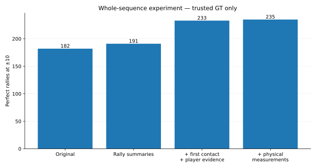

# Choosing the whole contact sequence at once

## Result

This experiment asked:

**Does it work better to compare a few finished versions of the rally and choose between them, rather than judge each repair separately?**

Yes.

This experiment uses **eight comparison videos with 677 proposed rally segments**. These are the eight videos used for the earlier held-out comparison, not the later 47-video ShuttleSet22 run. They were excluded from fitting for this experiment, although they had been seen elsewhere in the project.

The numbers below count how many of those 677 proposals are completely correct:

| System | Perfect proposals at ±10 | Repairs / losses vs original |
|---|---:|---:|
| Original detector | 182 / 677 = **26.9%** | — |
| **Best whole-sequence model** | **235 / 677 = 34.7%** | **56 / 3** |

At ±5, the same predictions repair 44 rallies and lose 24. Nearly all of those tighter-timing losses come from replacing the first contact.

## What the model could choose

For each proposed rally, the model could:

- keep the original sequence;
- add a possible earlier first contact;
- replace the first contact;
- remove one apparent extra contact;
- combine a first-contact repair with one removal.

It could not yet add a missed contact later in the rally.

## What information mattered

| Information available | Perfect rallies at ±10, trusted GT |
|---|---:|
| Original detector | 182 |
| Overall rally summaries | 191 |
| + first-contact and player evidence | 233 |
| + saved physical measurements | **235** |

The big gain comes from judging first-contact and player evidence **in the context of the finished rally**.

The physical measurements add only two more perfect rallies, but reduce losses from nine to three. Their main value here is avoiding bad edits.

## What the 56 repairs were

At ±10:

- 44 add a missing first contact;
- 9 remove an extra contact;
- 1 replaces the first contact;
- 2 combine a first-contact repair with a removal.

The three losses are two bad first-contact replacements and one extra event introduced by an addition.

At ±5, **23 of the 24 losses are first-contact replacements**.

The practical lesson is simple: keep a plausible existing first contact unless the replacement is clearly better.

## Decision

Carry the whole-sequence approach into the 47-video ShuttleSet22 comparison.

Next: [broader_comparison.md](broader_comparison.md).

## Data note

These eight videos were not used to fit the models in this experiment, but they had been seen elsewhere in the project. Treat this as a useful comparison, not a pristine final benchmark.

Saved results: `results/whole_rally_result.json.gz` and `results/whole_rally_predictions.json.gz`.
