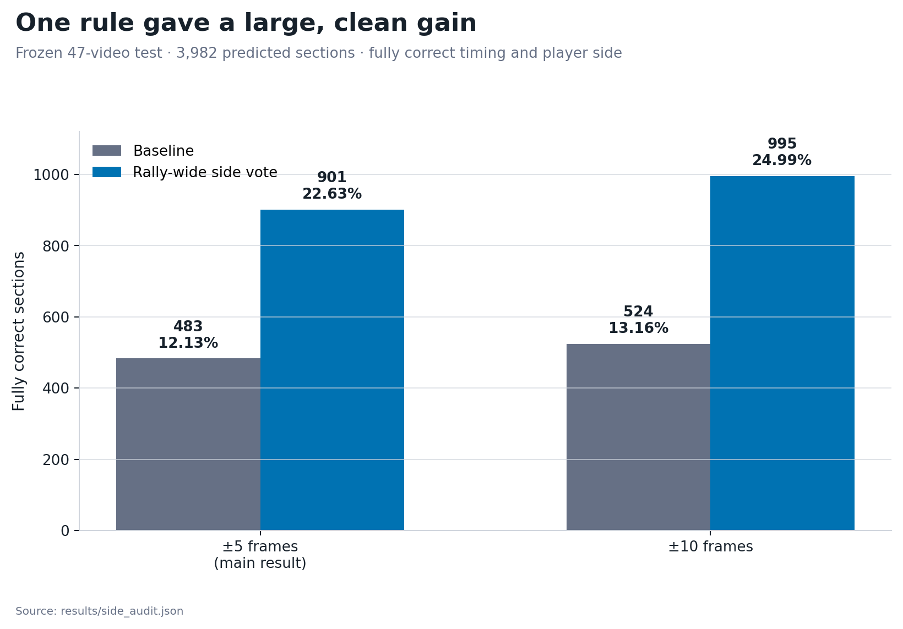
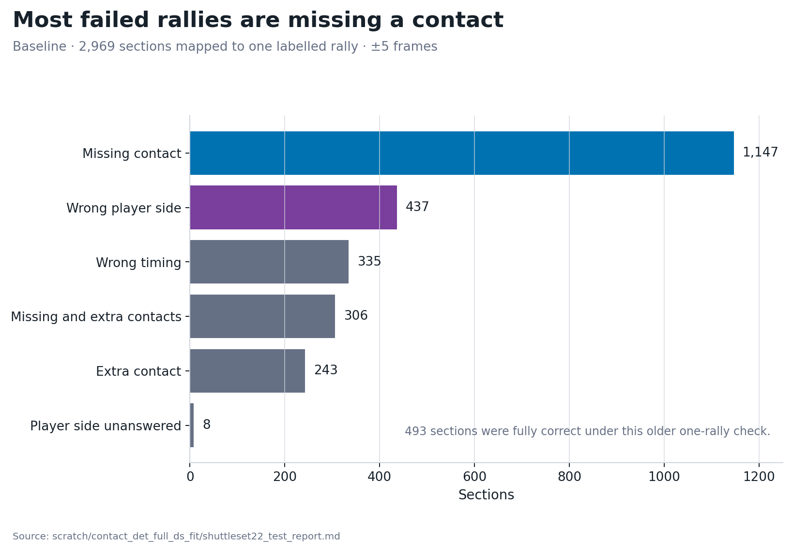
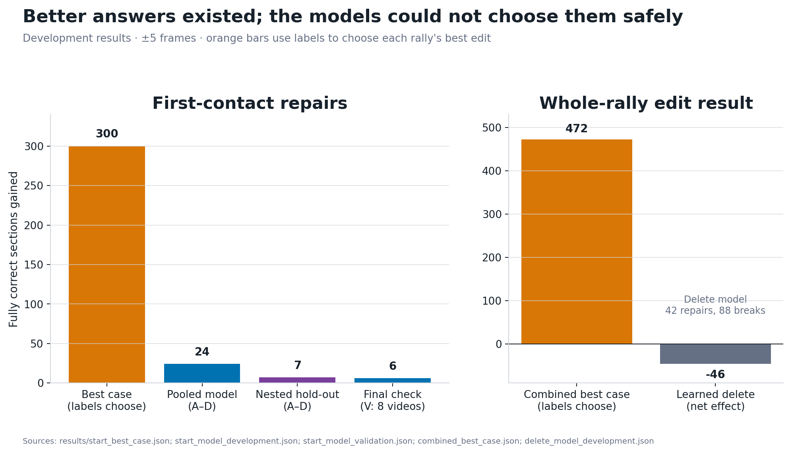
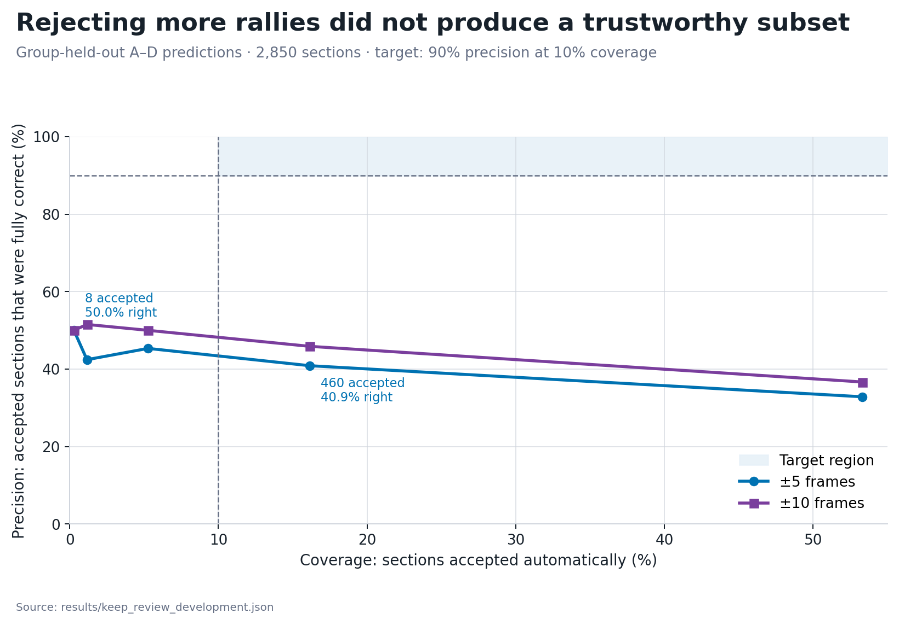

# What we learned from the contact-detector follow-up

## The short answer

The whole-rally player-side rule is the only clear improvement from this series. It almost doubled the number of fully correct outputs on the frozen 47-video test. At the main ±5-frame tolerance, the count rose from **483 to 901 of 3,982 sections**. The rule repaired 418 sections and broke none.

The saved candidate frames contain many better answers. The tested models cannot choose those answers safely. The keep-or-review model also missed its precision target by a wide margin.

The system is not close to a standalone, near-100%-precision auto-annotator.

## What the experiments were trying to learn

The contact detector scores possible hit frames. Later code turns those scores into a list of contacts, assigns a player side, and groups the contacts into rally sections.

The earlier test found useful individual contacts. Complete rally outputs were rarely right. This follow-up asked whether the remaining errors could be fixed cheaply with information the annotator already has:

1. Would the player labels improve if the whole rally had to alternate between the two court halves?
2. Were nearby events from opposite sides creating duplicate contacts?
3. Would a different score cut-off or merge distance make more complete contact lists?
4. Could a small model recover a missed first contact?
5. Could another small model remove one bad contact from a rally?
6. Could a model recognise the few rallies that were safe to accept without review?

The experiments did not change the contact vision model. They looked only for gains already present in the saved predictions.

## What counted as correct

A section was fully correct only when it contained one complete labelled rally, with every contact at the right time and assigned to the right court half.

The main result allows a timing error of five frames on a 30 fps clock. The report repeats each calculation at ±10 frames for context. The ±5 result remains the main measure.

Some experiments let the labels choose the best possible edit. These **best-case checks** measure how many useful answers exist among the saved candidates. They do not describe a rule that can run on a new video. The report identifies every result from a model that chose without labels.

## What happened

| Experiment | Main result | What it tells us |
| --- | --- | --- |
| Choose sides across the rally | 418 repairs and 0 breaks on the frozen test at ±5 | Use it when complete rallies are the goal |
| Remove close opposite-side duplicates | No qualifying pair in development or test predictions | There was nothing for this rule to fix |
| Change the contact cut-off | 139 repairs and 126 breaks on development timing at ±5 | Too much churn for a net gain of 13 |
| Repair the first contact | 6 repairs and 0 breaks on eight untouched videos | A real but small lead |
| Learn when to delete a contact | 42 repairs and 88 breaks on development at ±5 | The model made the output worse |
| Accept only likely-correct rallies | 40.87% precision at 16.14% coverage | The model could not find a clean automatic subset |

“Coverage” means the share of predicted sections the model accepts. Rejecting most sections can raise precision. The accepted remainder still has to be dependable.

## The baseline errors were not one problem

Among the 2,969 baseline sections that mapped to one labelled rally, missed contacts were the largest error group. Wrong player sides were the next clear repair target. Timing errors and extra contacts also mattered.

The older error audit counted 493 sections as fully correct. In ten cases, the timing allowance reached past a section edge. The stricter recount excluded those cases. Its baseline is 483 sections.

One confidence score cannot describe all these errors. A contact can look convincing even when the rally misses an earlier hit. The rally may also contain an extra event, start in the wrong place, or assign the wrong player.

## 1. Choosing player sides across the whole rally worked

Badminton contacts normally alternate between the two court halves. The baseline assigned Top or Bottom to each contact separately. The follow-up compared the two possible alternating patterns for the complete contact list and kept the better-supported one.

The minimum vote gap was chosen on 40 development videos. Each of those videos had contact predictions from a model that did not train on it. The fixed rule was then scored once on the separate 47-video test.

| Tolerance | Baseline | With the rally-wide vote | Repaired | Broken |
| --- | ---: | ---: | ---: | ---: |
| ±5 frames | 483 / 3,982 (12.13%) | 901 / 3,982 (22.63%) | 418 | 0 |
| ±10 frames | 524 / 3,982 (13.16%) | 995 / 3,982 (24.99%) | 471 | 0 |

At ±5, the rule found 418 of the 434 strict repairs available from the two alternating patterns. The rule missed only 16 possible repairs.

Accuracy on individual matched-contact side labels fell from 92.02% to 91.13%. Contact-and-side F1 fell from 75.74% to 75.07%. The alternating sequence improves the complete rally, but some individual side labels get worse.

Use the rally-wide vote for complete-rally output. Keep the old assignments when each contact must stand on its own.

## 2. The simple contact-list changes did not help enough

The duplicate audit looked for adjacent events from opposite sides within two frames. It found none in the saved development predictions. It also found none in the frozen test predictions. The proposed cleanup rule had nothing to remove.

The setting sweep tried 57 combinations of contact cut-off and merge distance. The best development setting lowered the cut-off from 0.90 to 0.85 and kept the six-frame merge distance.

| Tolerance | Baseline timing-complete sections | Revised | Repaired | Broken | Net |
| --- | ---: | ---: | ---: | ---: | ---: |
| ±5 frames | 940 | 953 | 139 | 126 | +13 |
| ±10 frames | 1,045 | 1,070 | 167 | 142 | +25 |

The lower cut-off found more first contacts, but it also added false contacts. At ±5, first-contact recall rose from 49.39% to 53.47% while contact F1 fell from 88.49% to 88.38%.

The setting sweep measured contact timing only. Most alternative frames in the compact saved data do not have player-side labels. No complete-rally gain was measured.

The test data lacks the raw per-frame scores needed for a cheap 0.85 rescore. The 0.85 cut-off has not been checked on the frozen test.

The global cut-off should remain 0.90 for the main ±5 measure. The +25 development result becomes worth one fresh test if ±10 becomes the release tolerance. That test needs the full raw scores.

## 3. Better first contacts exist, but the model found few of them

The first-contact check used the 32 development videos in groups A–D. The eight videos in group V stayed untouched until the final model choice.

Labels chose whether to keep the current start, add an earlier candidate, or replace the first event. The best-case timing check repaired 318 sections. Applying the rally-wide side vote afterwards made 300 sections fully correct.

The candidate lists already contain many correct first contacts.

The label-free model recovered only a small part of that opportunity. On A–D, the cautious pooled choice repaired 24 sections and broke none. A stricter group-held-out estimate repaired seven. The fixed model then changed 15 sections on the untouched V videos. It repaired six and broke none.

The six clean repairs on V show that the features carry some useful signal. Six repairs are too few to justify another layer in the current pipeline. A better contact model or first-contact candidate source is more promising than another threshold for this chooser.

## 4. The whole-rally edit search found room, but the delete model was unsafe

The combined best-case check allowed three things: one small start edit, one deletion, and either alternating side pattern. Labels chose the best allowed output for each A–D section.

At ±5, this raised fully correct sections from 726 to 1,198. The 472 possible repairs included 90 sections that needed a deletion and another 15 that only needed the other side pattern. At ±10, the combined ceiling rose from 822 to 1,356.

The saved search space contains better answers. The annotator cannot yet recognise them.

The learned delete model selected 497 deletions at its best descriptive setting. At ±5, it repaired 42 sections and broke 88. The net loss was 46 sections. At ±10, it repaired 49 and broke 104. The net loss was 55.

Each group also faced a safety check based only on the other groups. None passed, so every group kept its original output.

The delete model makes the output worse. It cannot tell a harmful extra contact from a real one.

## 5. The keep-or-review model could not find a clean subset

The most direct route to a low-recall, high-precision annotator is to let the model abstain. It can accept only the rallies it thinks are fully correct and send everything else to review.

The model was trained and scored with group-held-out predictions from the 32 A–D videos. Its target was at least 90% precision while accepting at least 10% of sections.

At the nearest tested point above 10% coverage, it accepted 460 of 2,850 sections:

- 40.87% were fully correct at ±5
- 45.87% were fully correct at ±10

Raising the threshold did not solve the problem. At 5.26% coverage, precision reached 45.33% at ±5 and 50.00% at ±10. At the strictest non-empty point, the model kept only eight sections and got four right.

The current features do not support a near-perfect automatic subset. Retuning the same keep-or-review model is unlikely to fix that.

## Are we closer to a standalone, near-100%-precision annotator?

We are closer on the number of correct rallies, not on trustworthy auto-acceptance.

The rally-wide side rule moves complete-output precision from 12.13% to 22.63% at ±5. The strict complete-rally check still marks 3,081 of 3,982 predicted sections wrong.

The keep-or-review model tested trustworthy auto-acceptance. Even when it accepted only eight sections, its precision was 50%.

The results mean that:

- the annotator can produce more correct complete rallies than before;
- it cannot yet recognise which of its complete rallies are safe to trust;
- low gross recall does not rescue the current approach; and
- the missing ingredient is better evidence, not another cut-off on the same scores.

## What can we say about different broadcasts?

The side vote was fixed before the 47 test videos were scored, so the gain is not a development-set artefact. The rule also uses a stable feature of badminton—the players normally alternate contacts—which makes it a sensible candidate for broader testing.

The test set was not reported by camera layout, tournament, on-screen graphics, or broadcast style.

Contact precision also fell when the model moved from development videos to this test set. We do not know whether the full annotator stays calibrated under a new broadcast convention. We also do not know whether its confidence scores remain reliable.

A claim about generalisation needs a test that holds out whole broadcast families, not just individual videos. It also needs a precision-versus-coverage curve for each held-out family. The [next-steps note](next_steps.md) describes that experiment.

## What is worth carrying forward

Use the whole-rally side vote when complete alternating rallies are the desired output. Keep the small fall in local side accuracy visible in any integration note.

Keep the first-contact result as evidence for future model work. The candidate lists contain useful missed starts, but the current chooser is too weak.

Revisit the 0.85 cut-off only if ±10 becomes the release measure and the raw test scores can be regenerated.

Spend new effort on stronger upstream evidence and a genuine broadcast-shift test. The duplicate cleanup, learned delete rule, and current keep-or-review model have answered their questions.
