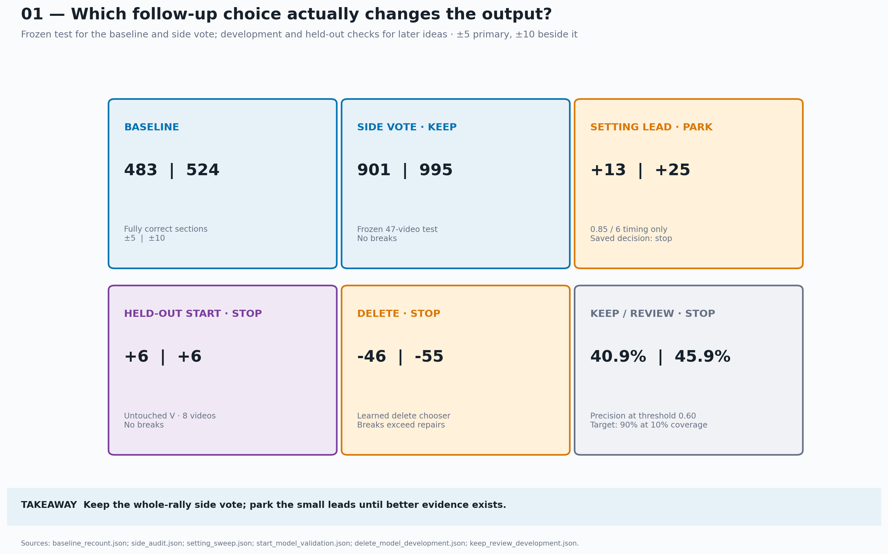
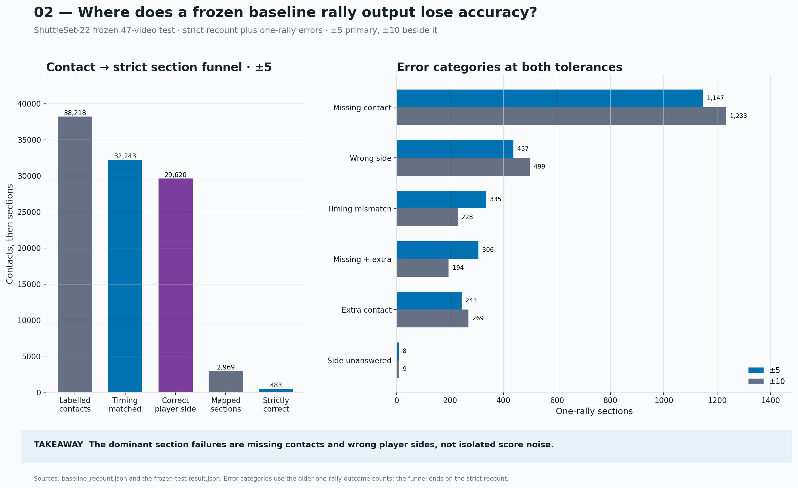
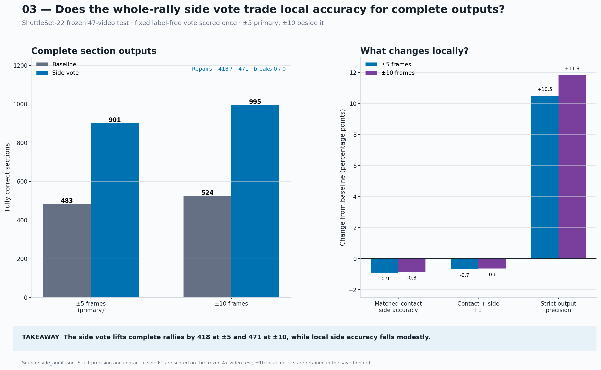
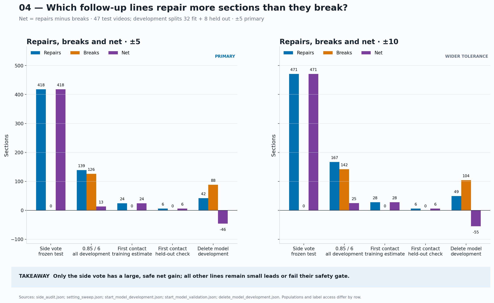
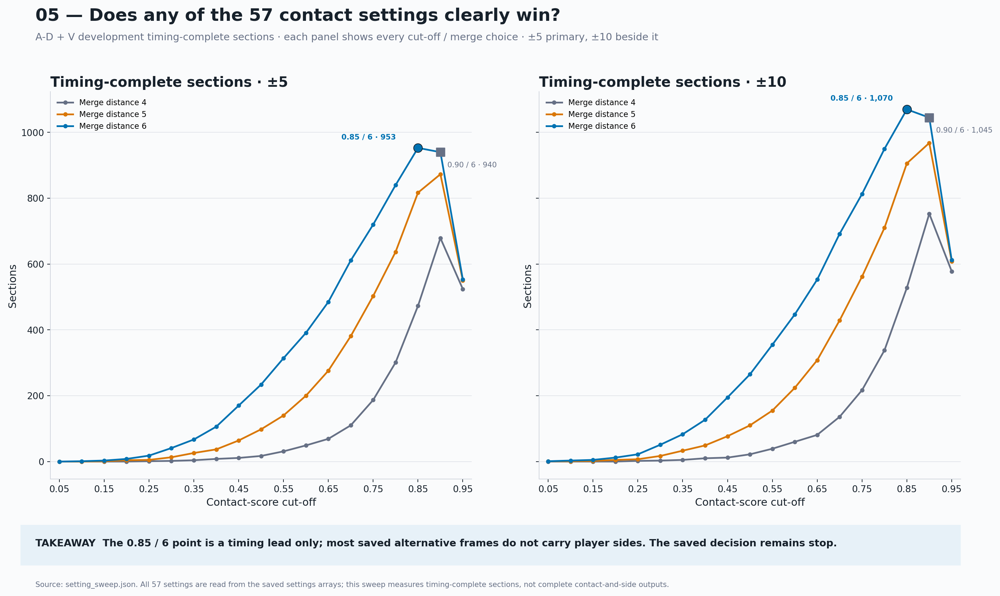
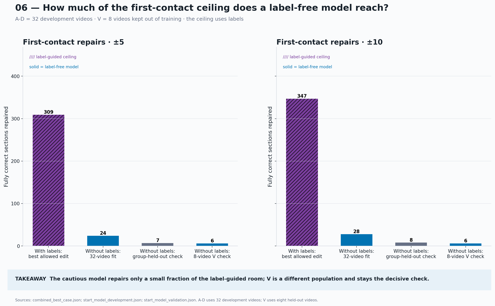
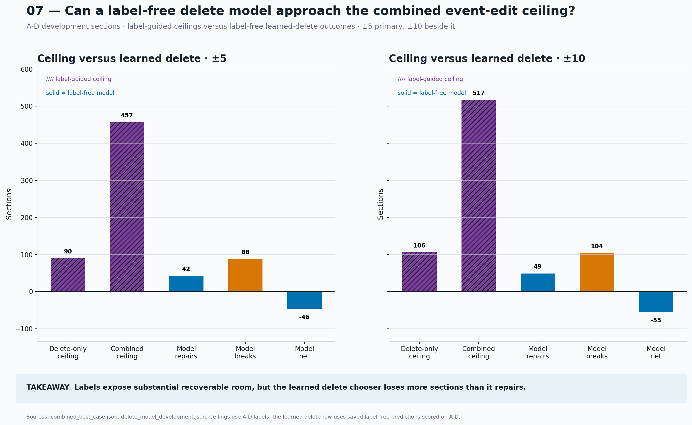
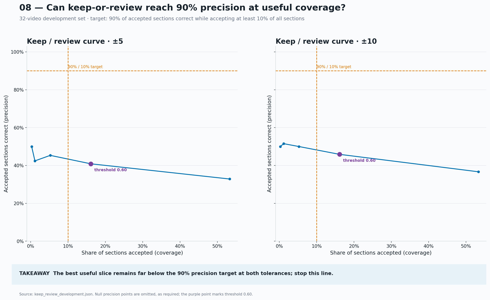
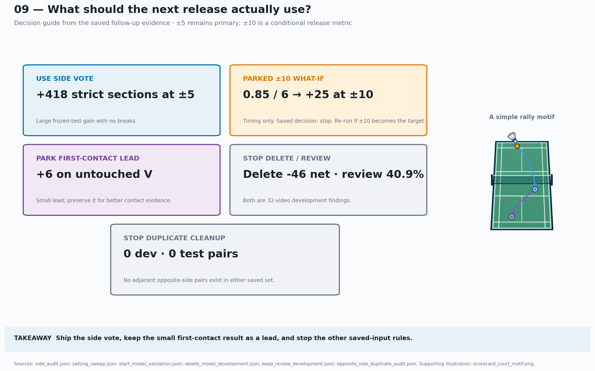

# Visual guide to the contact detector follow-up

## Bottom line

The whole-rally player-side vote is the one clear low-cost improvement. It nearly doubles fully correct frozen-test outputs at both timing tolerances. The other small models either add little or break more rallies than they repair.

This guide tells that story in nine standalone images. Each image includes its dataset, timing tolerance, result type, main limitation, and practical takeaway.

## How to read the figures

All tolerances use base-30 frames. A ±5 result allows a prediction to sit within five frames of the labelled contact at 30 frames per second. The ±10 result uses a wider allowance. The ±5 result stays primary.

The figures use three kinds of evidence:

- **Frozen test:** one final score on 47 videos after the rule was fixed
- **Label-free held-out result:** the rule acts without labels on videos excluded from its model training
- **Label-guided ceiling:** labels choose the best allowed action for each rally, which shows room to improve rather than deployable performance

## 1. What did the follow-up find?



The scorecard gives the complete answer in one page. The side vote is ready to carry forward. The saved decision for the 0.85 cut-off is stop, although its ±10 result gives a clear what-if to rerun if that tolerance becomes the target. First-contact work is small but clean. Delete and keep-or-review work stop.

## 2. Where does the baseline lose the story?



The left side follows contact evidence into strict full-rally outputs. The right side shows the error mix among sections that map to one labelled rally. Missing contacts dominate, while wrong player side is the clearest large repairable group.

## 3. Why keep the whole-rally side vote?



The vote repairs 418 frozen-test sections at ±5 and 471 at ±10. It breaks none. Individual matched-contact side accuracy and contact-and-side F1 fall slightly, so the rule suits a product that values complete alternating rallies.

## 4. Which rules help more than they hurt?



The side vote has a large clean gain. The first-contact choices stay positive but small. The setting change trades many repairs for almost as many breaks. The learned delete chooser moves backwards.

The rows use different scoring populations. The chart compares direction and safety rather than ranking raw counts across datasets.

## 5. Does a different score cut-off help?



The full 57-setting sweep favours cut-off 0.85 with the existing six-frame merge distance. It adds 13 net timing-complete sections at ±5 and 25 at ±10. Most alternative frames lack player sides, so this remains a timing-only development lead. The saved decision remains stop.

## 6. How much of the first-contact ceiling was realised?



Labels can find hundreds of start repairs in the saved candidates. The cautious model recovers only a small share. Its final V check repairs six sections at either tolerance and breaks none.

## 7. Why did the whole-rally event chooser stop?



The saved candidates contain many label-guided repairs. The learned delete chooser cannot select them safely. At ±5 it repairs 42 sections and breaks 88. At ±10 it repairs 49 and breaks 104.

## 8. Can the model find a clean automatic subset?



No tested threshold reaches 90% precision while keeping at least 10% of sections. The nearest point above 10% coverage reaches 40.87% precision at ±5 and 45.87% at ±10.

## 9. What is worth doing next?



Carry the side vote into the next integration decision. If ±10 becomes the release measure, rerun the 0.85 cut-off as a new test. Treat first-contact work as evidence for a future contact model. The duplicate cleanup found no qualifying pairs in development or frozen test, so that line stops.

## How this maps to the original brief

The original brief suggested more than ten plots. This guide combines related questions so the story fits in nine images.

The series includes the suggested baseline funnel, section error counts, repairs-versus-breaks chart, best-case comparison, keep-or-review curve, and final scorecard. The setting sweep adds the requested ±5 and ±10 comparison.

The guide leaves out per-video dots, side-score-gap bins, candidate-rank coverage, frame-error histograms, and example timelines. Those views need more detail than the main decision requires. Some also lack a saved aggregate result.

## Rebuild the figures

Run this command from the repository root:

```bash
~/.venvs/badminton-cicd/bin/python \
  -m scratch.contact_det_followup.scripts.plot_visual_guide
```

The script reads the existing baseline and follow-up result files. It writes matching PNG and SVG files under `scratch/contact_det_followup/figures/`. The plotting pass does not copy the baseline records.

The small court motif in figure 9 is a text-free generated illustration. Matplotlib supplies every label, value, chart, and decision.
