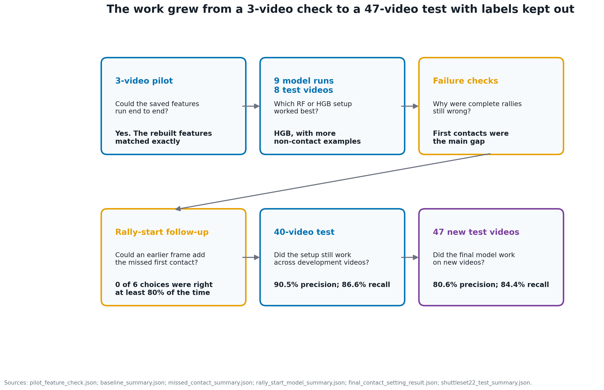
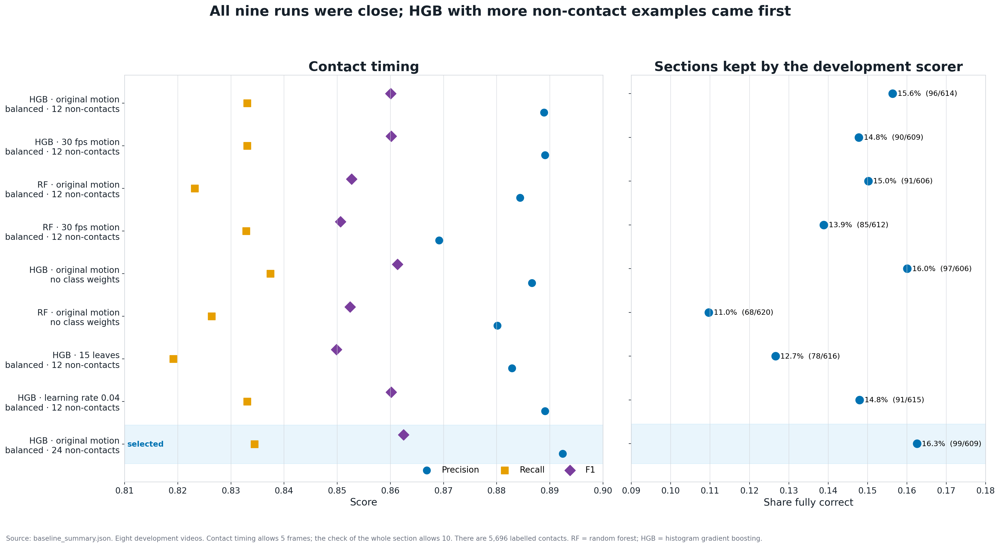
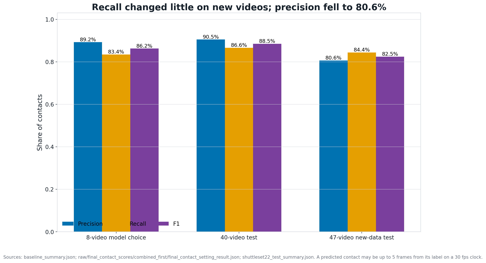
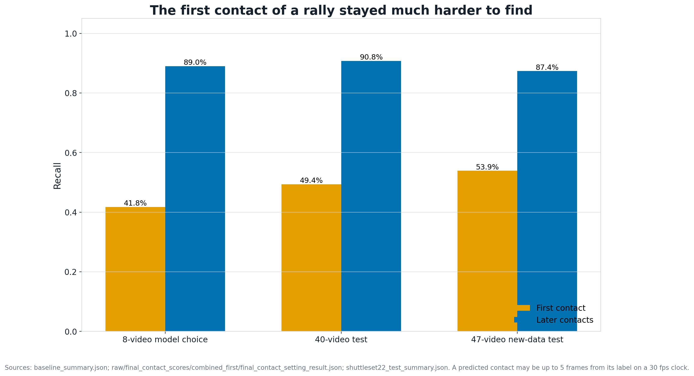
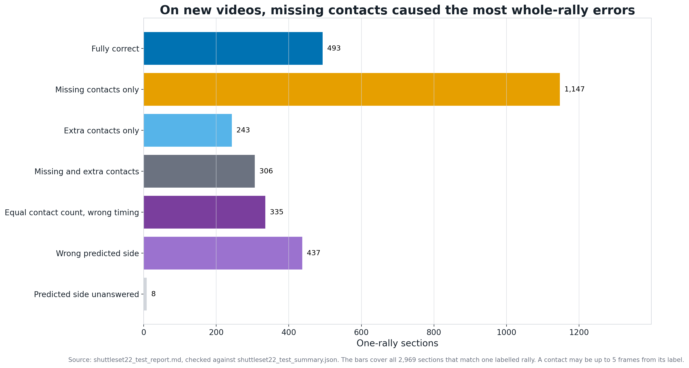
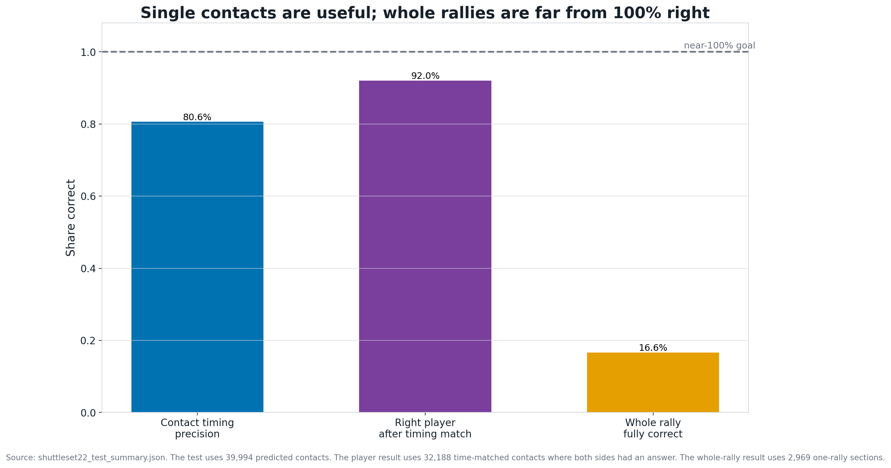
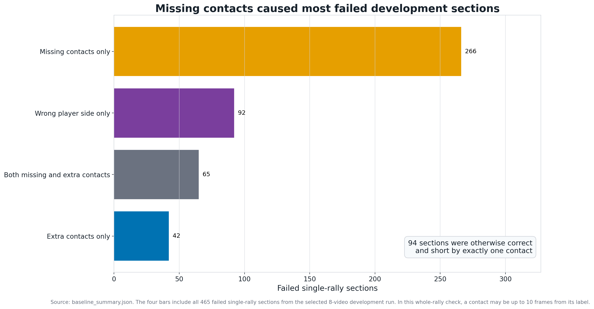
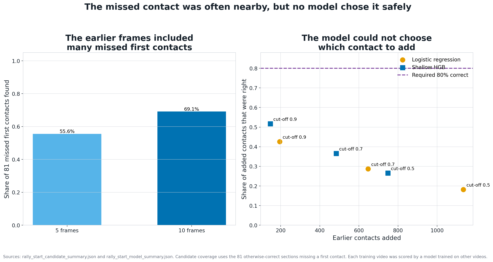
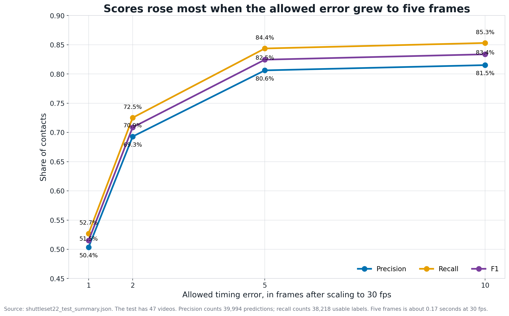
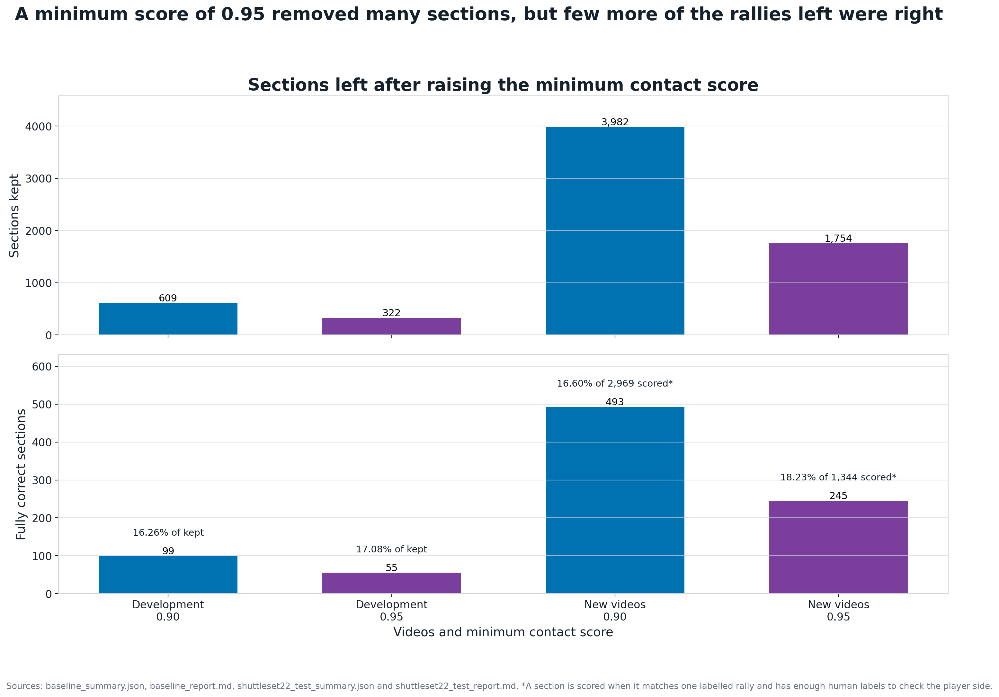

# Visual quick guide

These pictures show what the RF and HGB tests tried, what happened and what still fails. The full set takes about five minutes to read.

## Table of contents

- [The six-picture story](#the-six-picture-story)
- [1. The study went from 3 videos to 47 new videos](#1-the-study-went-from-3-videos-to-47-new-videos)
- [2. HGB came first in the nine model runs](#2-hgb-came-first-in-the-nine-model-runs)
- [3. Precision fell on the new videos](#3-precision-fell-on-the-new-videos)
- [4. First contacts stayed much harder](#4-first-contacts-stayed-much-harder)
- [5. Most wrong sections were missing contacts](#5-most-wrong-sections-were-missing-contacts)
- [6. Single contacts are useful, but few whole rallies are right](#6-single-contacts-are-useful-but-few-whole-rallies-are-right)
- [Extra plots](#extra-plots)
- [The result in one paragraph](#the-result-in-one-paragraph)

## The six-picture story

The first six pictures show the main result.

## 1. The study went from 3 videos to 47 new videos

The development data chose the model and all its settings. The ShuttleSet22 labels were not read until all 47 prediction files had been saved.

## 2. HGB came first in the nine model runs

The nine runs had similar contact F1 scores. The chosen HGB run also had the most fully correct sections among those kept by the development scorer. It came first on both checks.

The winning setup used the original motion values. It also used balanced class weights and up to 24 non-contact training rows for each real contact row.

## 3. Precision fell on the new videos

F1 was **88.49%** across the 40 development videos. Each video was scored by a model trained on the other 32. F1 was **82.45%** on ShuttleSet22.

Precision fell by **9.88 percentage points**. Recall fell by only **2.21 points**. The model still finds many real contacts in the new videos. It also predicts more contacts that have no matching label.

## 4. First contacts stayed much harder

First-contact recall rose from 41.77% on the original validation set to 53.92% on ShuttleSet22. Later-contact recall stayed near 90%.

First-contact recall stayed well below later-contact recall in all three tests. The detector still needs a separate way to handle rally starts.

## 5. Most wrong sections were missing contacts

Only **493 of 2,969 one-rally sections** were fully correct at five frames.

Missing contacts caused the most failures. Extra contacts, wrong timing and wrong player side also broke many sections.

## 6. Single contacts are useful, but few whole rallies are right

These three percentages use different groups of results:

- **80.62% contact precision** across all ShuttleSet22 predictions;
- **92.02% player-side accuracy** after a timing match and two answered sides; and
- **16.60% fully correct sections** among sections that map to one labelled rally.

They count different things, so they cannot be combined into one score. The result gets worse as the test grows from one contact to a whole rally.

The tests did not find any group of whole rallies with near-100% precision.

## Extra plots

### Development error mix

The development test also failed most often because contacts were missing. Wrong player choice was the next largest group.

### Rally-start follow-up

The list contained the missed first contact for 56 of the 81 target rallies. The best small model was right only 51.7% of the times it added a contact. The test required at least 80%. The test stopped before the validation labels were read.

### Timing tolerance

F1 on ShuttleSet22 rises from 51.50% at one frame to 82.45% at five frames. The detector often finds the right moment without landing on the exact labelled frame.

### Do high contact scores find clean rallies?

The score helps with single contacts. It does not show whether a whole section is right. Raising the minimum score to 0.95 removes many sections. The share that are fully right stays around 17–18%.

### What changed when the minimum score changed

Among the settings tested, 0.9 gave almost the highest precision. A higher minimum adds little precision. It loses more recall and produces fewer contacts.

## The result in one paragraph

HGB is a useful simple contact detector. It still finds contacts on ShuttleSet22, but it makes more false predictions there. The small model for adding missed first contacts was not safe enough. Next, sections need to start and end in the right place. The system also needs a safer way to find first contacts, remove extra contacts and flag an unsure player choice. A final model could then decide whether to keep or reject each whole rally.
