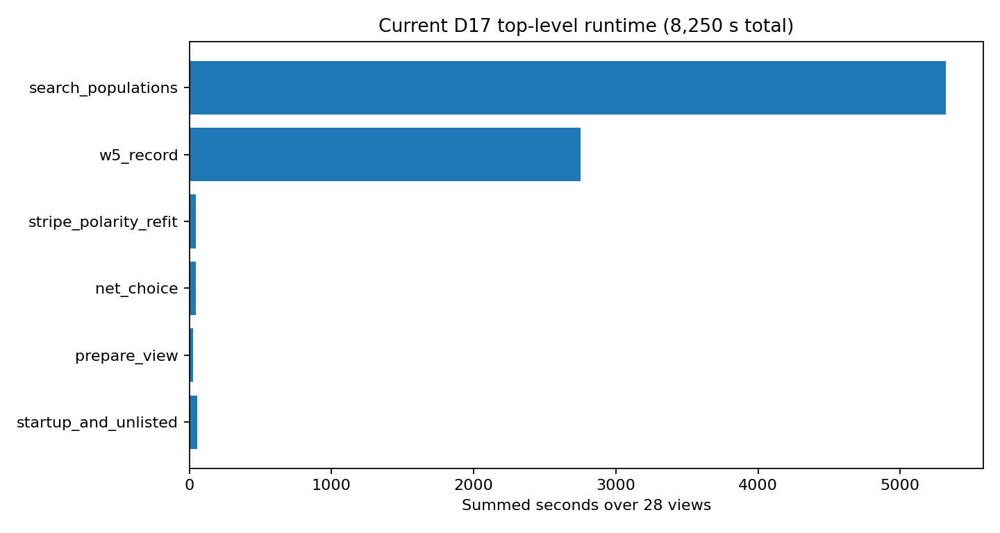
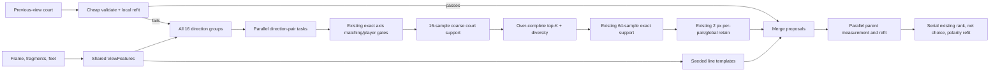
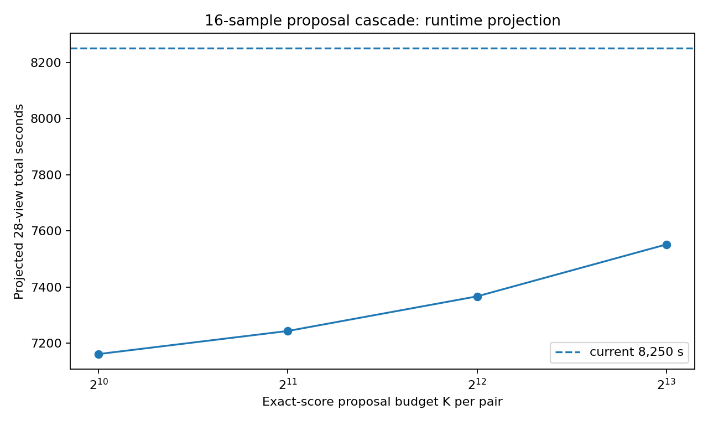
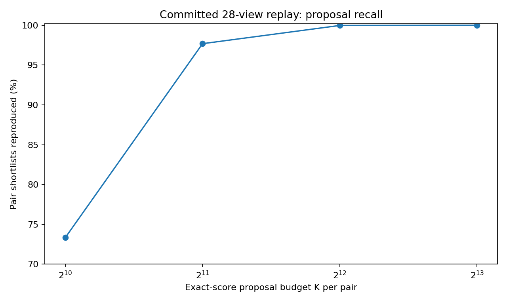
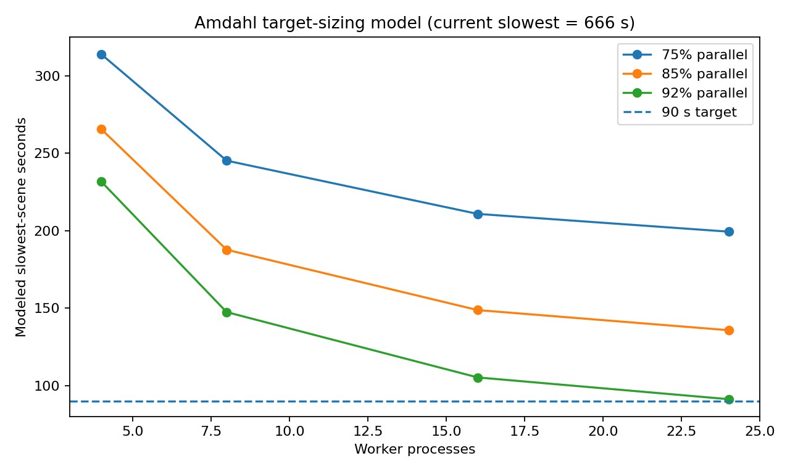

# Court detector proposal/refinement architecture evaluation

## Executive decision

The optimisation work has not exhausted every possible instruction-level tweak, but it **has exhausted the high-value, low-risk ones**. The branch has already removed the two original dominant pathologies, then applied several exact array-layout and cache rewrites. At the reviewed head, the detector still takes **8,250 summed process-seconds over 28 views**, or **295 s per view on average**, and the slowest committed view takes **666 s**. Search consumes 5,319 s and W5 consumes 2,754 s, so almost the whole latency is now useful proposal, scoring, measurement, and refit work rather than obviously accidental overhead.

A 90 s maximum cannot be reached by another round of 1–5% edits. It requires two structural changes:

- expose the existing independent work as a deterministic, parallel task graph; and
- stop sending every viable court through the most expensive exact scoring path, using a coarse proposal stage with a conservative fallback.

This is directly analogous to Faster R-CNN engineering, without introducing a learned model:

- the already-computed line groups, distance maps, player masks, and view context are the **shared backbone features**;
- the 16-sample court support and axis evidence are the **region proposal score**;
- the existing 64-sample finite support, W5 evidence, stripe refit, camera gates, net choice, and polarity refit are the **exact ROI head**;
- the existing 2 px greedy retention is **NMS**;
- previous-view court reuse is a **high-priority external proposal**, not a replacement detector.

The proposal cascade should be an optional deployment mode with a full-search fallback. The exact deployment mode should remain the regression oracle.

## 1. Baseline and target gap

The most recent committed timing comparison reports:

| Measure | Current value |
|---|---:|
| 28-view summed wall time | 8,250 s |
| Mean per view | 294.6 s |
| Slowest view | 666 s |
| Search/populations | 5,319 s (64.5%) |
| W5 record | 2,754 s (33.4%) |
| `finite_scores` | 2,054 s (24.9%) |
| `match_axis` | 1,384 s (16.8%) |
| `stripe_measure` | 1,156 s (14.0%) |

The target therefore requires:

- **3.3×** speed-up at the mean; and
- **7.4×** speed-up on the slowest scene.

Those factors are relative to one numerical thread per existing view process. A maximum-latency target is not meaningful without a deployment hardware SKU, so this pack models 4, 8, 16, and 24 worker processes and recommends fixing the final acceptance machine before implementation choices are locked.

## 2. What the branch has already solved

The current branch is materially different from the original static handover. The major exact changes already include:

- player testing only after geometry, then replacement by a joint matrix-product player test;
- player gating before axis scoring;
- stripe evidence restricted to direction-compatible fragments;
- deterministic, faster non-IPP distance transforms;
- per-view refit distance-map reuse;
- separated x/y/w array layouts in several NumPy hot paths;
- lazy provenance construction;
- a rewritten template camera check;
- cached observation preparation;
- seated-person removal in the deployed feet input.

The measured effects were large:

- six-view run: 6,255 → 2,572 s after the first two hotspot fixes;
- 20 court views: 20,647 → 13,942 s after player and axis rewrites;
- 28 views: 13,002 → 8,931 s after exact array-layout and reuse changes;
- 28 views: 8,931 → 8,250 s after the camera-check and observation-cache changes.

The important implication is that the current cost is no longer dominated by one embarrassing allocation or redundant transform. The remaining large stages are the actual search and exact evidence pipeline.

### Quality constraints learned by the branch

Several tempting shortcuts have already failed the precision/recall requirement:

- Dropping four direction groups with the SVD12 screen roughly halved an older run, but changed the corrected court on 5 of 20 court views and made two clearly worse.
- A per-pair shortlist cap of 32 loses an accepted court; accepted parents can rank 41st within their pair and 107th globally before W5 reorders them.
- A fixed coarse proposal depth is not self-certifying: one committed call needed 4,511 candidates, so K=4,096 missed a retained court.
- Movement or detector-score caps on people can reject real courts.
- A camera gate cannot safely move ahead of refit because an invalid parent can produce a valid child.

Therefore the architecture must retain:

- all 16 direction groups;
- G0, G1, and seeded line templates;
- the existing exact ranking/refit stages;
- generous proposal diversity; and
- a fallback to the full search whenever the proposal stage is uncertain.

## 3. Are the common-sense tweaks tapped out?

**Mostly, yes.** The credible exact single-thread headroom is approximately 8–12%, with some overlap:

| Remaining exact item | Evidence-based gain | Comment |
|---|---:|---|
| Remove research disk write/read path | about 580 s, 6.5–7% | High confidence; required for deployment anyway |
| Skip legacy pool evidence in deployment | under 480 s in an older run; now less | Exact for accepted selection, but current saving needs remeasurement |
| Finish survivor-only object materialisation | at most 175–179 s, about 2% | Pair-loop own time now caps the gain |
| Larger scoring batches | a few percent of affected stage | Low complexity, small whole-run effect |
| Dense Gaussian response-map reuse | synthetic upper bound below 3.3% whole run | Exact candidate, but only profitable on large pairs |

The synthetic response-map benchmark in this pack transforms each pair's two dense distance maps into Gaussian response maps once, then gathers response values instead of repeatedly applying `exp` after the gather. It was bit-identical on NumPy 2.3.5. Including precomputation, it was slower at 256–1,024 courts, 1.08× faster at 4,096 courts, and 1.15× faster at 16,384 courts. Because projection, clipping, indexing, visibility, and marking aggregation remain unchanged, the whole `finite_scores` function would gain less than that. Even the unrealistic assumption that all 2,054 s of `finite_scores` sped up by 1.15× saves only about 3.3% of the whole run.

This tweak is worth a guarded experiment because it is small and exact, but it is not the route to 90 s.

### Negative result: best-first Cartesian enumeration alone

A 512×512 axis product contains 262,144 combinations. A heap can emit the best separable axis-score combinations without materialising the full matrix. In the synthetic benchmark it was 5.8× faster for K=256 and 2.0× faster for K=1,024, but slower than NumPy's full outer product for K=4,096 or 8,192. More importantly, the committed detector now spends only about 175 s of 8,250 s in pair-loop own time; `combine` itself is 286 s. Replacing Cartesian enumeration without reducing exact court scoring attacks the wrong denominator.

Treat best-first enumeration as a memory/control-flow tool inside a proposal cascade, not as a headline optimisation.

## 4. Recommended architecture: shared features, proposal cascade, exact head

### 4.1 Shared `ViewFeatures`

Build one immutable object per scene containing:

- resized frame and greyscale/paint views;
- fragments, grouped observations, family membership, and vanishing directions;
- rectified feet and player band masks;
- distance maps and optional response maps;
- seeded-template inputs;
- image/native/working coordinate transforms.

This removes the current stage boundary re-loads and makes it possible for worker processes to receive compact IDs plus shared-memory arrays rather than repeatedly reconstructing context.

This is the non-neural equivalent of a shared CNN backbone: expensive view-level representation is computed once and reused by all proposals and later heads.

### 4.2 Keep current axis generation

Do not replace `match_axis`. It already contains valuable exact structure:

- line-identity anchors;
- endpoint residual scoring;
- player compatibility before scoring;
- distinct matched-line assignments; and
- retained axis hypotheses.

The architectural change begins **after retained horizontal and vertical axes exist**.

### 4.3 Coarse proposal stage

For every geometry- and player-valid combined court:

1. evaluate the same finite-support formula with 16 samples per marking instead of 64;
2. rank stably by this coarse score;
3. take an over-complete proposal budget;
4. preserve diversity through the existing corner-distance retention or a proposal-only quota; and
5. run the unchanged 64-sample score on the proposal set.

The exact score, exact per-pair retention, global retention, W5, refit, ranking, net choice, and polarity correction remain unchanged.

This is a repackage of proven components rather than a new detector.

### 4.4 Why 16 samples and K=8,192 are the sensible first point

The committed observation-only replay covered 3,369 real scoring calls over 23 views:

| 16-sample exact budget | Pair shortlists reproduced | Court-scoring cost | Projected whole-run saving |
|---:|---:|---:|---:|
| 1,024 | 2,471 / 3,369 (73.3%) | 47% | 13.2% |
| 2,048 | 3,291 / 3,369 (97.7%) | 51% | 12.2% |
| 4,096 | 3,368 / 3,369 (99.97%) | 57% | 10.7% |
| 8,192 | 3,369 / 3,369 (100%) | 66% | 8.5% |

These are **pair-shortlist** results, not final accuracy measurements on unseen video. Nevertheless, they are stronger evidence than a synthetic score-correlation experiment because they replay the actual committed detector calls.

K=8,192 is the appropriate first implementation because:

- it reproduced every recorded pair shortlist;
- it still cuts the current court-scoring stage by roughly one third;
- it preserves a very wide margin over the 256 retained courts; and
- it permits exact verification before trying a more aggressive adaptive budget.

### 4.5 Adaptive K=4,096 with fallback

K=4,096 offers a larger theoretical saving but missed one of 3,369 shortlists. It should only be used with a fallback policy. A simple cost model is:

- normal two-pass cost: 0.57 of current court scoring;
- a call that later completes the full exact tail: approximately 1.43 of current court scoring, because it has already paid for the coarse pass.

Under that model:

| Full-tail fallback rate | Court-scoring ratio | Projected whole-run saving |
|---:|---:|---:|
| 5% | 61.3% | 9.6% |
| 10% | 65.6% | 8.6% |
| 25% | 78.5% | 5.4% |
| 50% | 100% | 0% |

A practical fallback trigger should combine:

- nested proposal budgets: compare shortlists after 2,048, 4,096, and 8,192 exact scores;
- proposal-cap saturation;
- small exact-score margin at the retained frontier;
- disagreement between G0/G1/templates;
- low visibility or unusual geometry;
- non-court/abstention ambiguity; and
- an optional exact upper bound for the unscored tail.

The current Lipschitz upper bound is safe but not a good primary accelerator. On six committed pairs, a bound-plus-tail model ranged from 0.64× to 1.44× the full exact cost and was about 1.05× in aggregate. It should be used only as a certifier after a good proposal ordering, not as the first screen.

No fallback rule has yet been evaluated against the committed call-level rows. Therefore K=4,096 is a second experiment, not the first deployment configuration.

## 5. Deterministic task parallelism

The current implementation contains two serial loops over naturally independent work:

- direction pairs in `w5_holistic/automatic_generation.py::generate`; and
- parents/refits in `w5_holistic/run_w5.py::process_case`.

### 5.1 Pair parallelism

Each pair can independently return:

- pair ID and direction IDs;
- retained candidate arrays;
- stable proposal indexes;
- minimal provenance; and
- timing/counter diagnostics.

The coordinator must merge results in original pair order before global retention. This preserves stable tie behaviour. Workers should not construct research records or write files.

G0 and G1 can either share one worker pool or be scheduled as two task classes. Their read-only arrays should be shared rather than copied for every task.

### 5.2 W5 parallelism

After `canonicalise_populations`, each unique parent measurement is independent. After parent records exist, each refit is independent. The exact schedule is:

1. canonicalise/deduplicate serially;
2. measure unique parents in parallel;
3. restore original parent order;
4. build the per-view line maps once;
5. refit parents in parallel;
6. restore original order; and
7. run the existing ranker, determinism check, net choice, and polarity refit serially.

The current cache must be converted into an explicit pre-deduplication table. Sharing a mutable cache between worker processes would be slower and harder to reason about than scheduling each unique homography once.

### 5.3 Latency target sizing

The chart below is an Amdahl-style model using the current 666 s slowest scene, 10% overhead on parallel work, and 10 s fixed scheduling/startup overhead.

Selected results:

| Parallelisable share | Workers | Modeled slowest scene |
|---:|---:|---:|
| 85% | 8 | 188 s |
| 85% | 16 | 149 s |
| 92% | 8 | 148 s |
| 92% | 16 | 105 s |
| 92% | 24 | 91 s |

If the exact/in-memory/cascade work first reduces runtime by 15–20%, the same optimistic 92% model gives:

| Algorithmic runtime retained | 16 workers | 24 workers |
|---:|---:|---:|
| 90% | 95.9 s | 83.2 s |
| 85% | 91.1 s | 79.2 s |
| 80% | 86.3 s | 75.1 s |

This establishes a practical engineering target:

- on a 16-worker deployment CPU, achieve at least about 15–20% validated algorithmic reduction and demonstrate roughly 92% effective parallel coverage; or
- on a 24-worker CPU, exact parallelisation alone may approach the target.

The percentages are not yet measured. The exact parallel prototype should therefore precede deeper proposal work: it will reveal the true serial fraction and memory-bandwidth ceiling.

## 6. Previous-view proposal and local expansion

View reuse is the largest lever for videos containing multiple scenes from the same fixed camera. It should be implemented as a proposal path, not as unconditional reuse.

For a scene whose camera signature matches a previous accepted view:

1. insert the previous homography as proposal zero;
2. remeasure it against the new scene's line/paint/stripe evidence;
3. run the existing stripe refit;
4. generate a small deterministic neighbourhood in the current axis scale/shift parameterisation;
5. exact-score and refit that neighbourhood; and
6. accept only if the current full gates, score margins, camera constraints, and temporal consistency checks pass.

Otherwise fall back to the complete 16-direction cascade.

Suggested camera signature:

- vanishing-direction angles and support masks;
- frame dimensions/crop/letterbox signature;
- dominant line-family offsets;
- fixed composition-mask hash or low-resolution edge signature; and
- previous court reprojection residual against current fragments.

This path reuses the detector's existing homography, line support, W5, and stripe refit concepts. It is analogous to supplying a high-quality external region proposal to Fast R-CNN.

Reuse alone does not satisfy a strict per-scene maximum, because the first scene for a new view still requires a full search. It becomes decisive once the first-scene path is near or below 90 s, and it should make subsequent scenes much cheaper.

## 7. Shared feature reuse beyond the first implementation

The most ambitious non-neural Faster-R-CNN analogue is to replace random 2-D map gathering for every court with reusable one-dimensional line profiles:

- a constant-court-x marking lies on an image line determined by the horizontal axis hypothesis;
- the vertical axis hypothesis only determines the segment interval along that line;
- symmetrically, constant-court-y markings can share profiles by vertical axis.

A proposal score can therefore precompute dense response profiles for each retained axis/marking and query interval support for every axis pair. This is a genuine shared-feature/ROI-pooling design and could reduce memory traffic substantially.

However, an interval average is not identical to the current 64 uniformly sampled pixels. It should first be used as a proposal score feeding the unchanged exact head. The committed 16-sample experiment already gives a lower-complexity version of the same idea with real-data evidence, so profile pooling is a later step only if the first cascade and parallel task graph miss the target.

## 8. Recommended implementation sequence

### Phase A — exact deployment architecture

- Create one in-memory D17 entry point.
- Remove research files, legacy pool evidence, diagnostic controls, replay, and sensitivity work in deployment mode.
- Split pair work into deterministic worker tasks.
- Split W5 parent measurement and refit into deterministic worker tasks.
- Keep a serial exact mode and require bit-identical output on all committed views.

Expected result: roughly 8–12% lower CPU work plus a several-fold wall-latency reduction on a many-core CPU. The parallel gain must be measured.

### Phase B — conservative proposal cascade

- Add `sample_count` to finite support without changing the 64-sample path.
- Run 16-sample support for every usable court.
- Exact-score top 8,192 per pair in stable proposal order.
- Preserve all current per-pair/global retention and W5 logic.
- Shadow-run full exact scoring and compare every pair shortlist during evaluation.

Expected result from committed data: about 34% off `finite_scores`, or 8.5% off the whole current run, with every recorded pair shortlist reproduced.

### Phase C — adaptive cascade and previous-view proposals

- Instrument K needed, score margin, cap saturation, visibility, and source agreement.
- Develop a K=4,096 → 8,192 → full fallback policy.
- Add previous-view validation/local refinement.
- Keep full-search fallback and production canary rechecks.

### Phase D — only if still required

- Factorised line-profile proposal score.
- Fused compiled/GPU exact score kernel.
- Lower working resolution only after a formal accuracy study.

## 9. What not to pursue

- SVD12 or any fixed direction-group drop.
- Smaller 256-court or axis caps without a much larger accuracy corpus.
- Pure top-K Cartesian axis score as the final proposal ranking.
- A fixed K=4,096 with no fallback.
- Earlier camera rejection.
- Movement/score-based people caps.
- A new learned detector solely to address this runtime problem.

## 10. Bottom line

The detector is not conceptually tapped out, but the **micro-optimisation phase is**. The remaining opportunity is to package the proven search as a modern proposal-and-head pipeline:

- shared view features;
- cheap, over-complete proposals;
- exact scoring only where it matters;
- deterministic NMS/merge;
- parallel exact heads; and
- previous-view proposals with full fallback.

On the committed evidence, the proposal cascade alone is an 8–11% whole-run lever, not a 7× lever. The 90 s target is therefore principally a parallel-latency and view-reuse problem. A 16-worker exact parallel prototype, followed by the 16-sample/K=8,192 cascade, is the most defensible next experiment.
