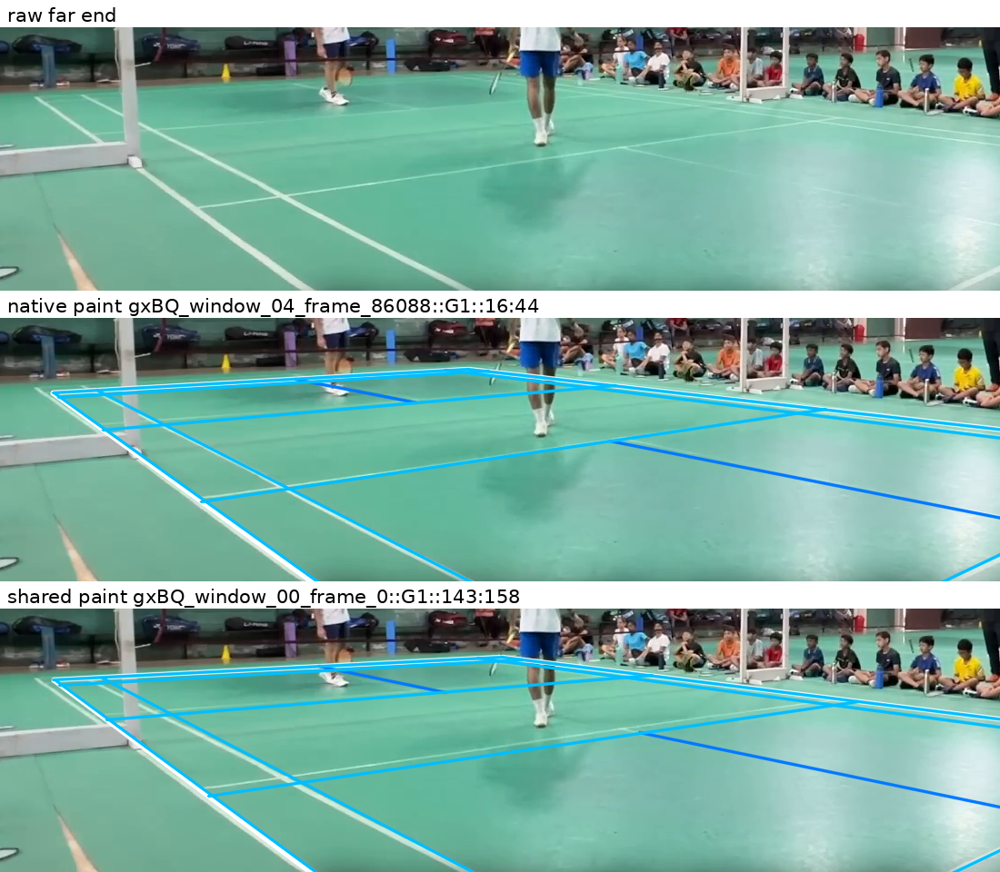

# Towards a CourtKeyNet-free detector

The strongest next prototype is **paint-filtered proposals plus line-template
proposals, with player evidence retained**. On the 27 development views, that
restricted candidate pool preserves the best reviewed W5 result: 24 usable
selections. The remaining failures need two different fixes: better proposals
on low-angle yellow courts, and better handling of contaminated broadcast
views. More visibility thresholds alone will not solve them.

This is a design recommendation, not a deployable detector or a held-out
accuracy claim. All four pickup comparisons are complete. Production
integration and CourtKeyNet removal have not
been performed in this evaluation pass.

For an independent visual and numerical review from GitHub, use the
[published evidence packet](evidence/review_20260922/README.md). The current
[design plan](DETECTOR_DECISIONS.md) adds the wider-test schedule, scene-level
requirements and deployment-speed leads to these experimental findings.

## What was compared

The comparison asks which proposal sources and scoring changes bring a
CourtKeyNet-free detector closer to reliable use.

All results use development data. The expanded panel contains 27 views;
several share a video or camera. The original nine have manual or previously
approved control courts. Expanded frozen references are descriptive aids,
not independently approved ground truth.
GX identifies views from one amateur video; Am1–Am4 identify other amateur
videos. SS identifies ShuttleSet broadcast scenes. Numbers identify sampled
frames or scenes, not independent datasets.

- **G0** generates courts from the original line fragments. **G1** filters
  those fragments for painted-line appearance before generation. Both use
  cached DeepLSD fragments and automatic directions.
- **S0/S1** score fixed proposals using original/paint-filtered fragments.
  Crossing these inputs separates proposal quality from ranking changes.
- **W5** adds line-template proposals and refinement to the G0/G1 pool.
  Its three admission settings require `(3,3)`, `(4,3)` or `(5,3)` visible
  projected markings, ordered lengthwise then cross-court. These counts apply
  to the line-template source before retention. They do not verify actual paint.
- The corrected **person-mask** experiment removes fragments inside correctly
  aligned person boxes. It is separate from the **player-support gate**, which
  tests temporal foot positions against a projected court.

Visual `usable` means that the overlay identifies the played court and follows
its visible markings well enough for further development. It has no fixed
pixel tolerance and does not establish unseen-corner accuracy. Numerical
control diagnostics below use maximum corner distance at 960×540 working
resolution; a 15 px threshold summarises those distances, not visual usability.

## W5: useful proposals, unsafe automatic acceptance

All 81 arm/case selections were checked, covering 30 distinct geometries.
The `(4,3)` and `(5,3)` arms select identical geometry on every case.

| Candidate access and selection | Visually usable | Remaining failures |
| --- | ---: | --- |
| W5 `(3,3)` | 19/27 | Eight views |
| W5 `(4,3)` or `(5,3)` | 21/27 | GX689, GX77876, GX86088, yellow14, Am1-54, SS21-10 |
| `(4,3)` plus existing player-support gate | 24/27 | yellow14, Am1-54, SS21-10 |
| Same gate and ranking, G1 + line-template access only | 24/27 | Same three views |

The player gate requires valid geometry and camera error at most 0.1.
At least one foot must lie in the expanded court on every sampled frame;
both court halves must contain feet on at least half the frames. Applying it
to the saved span-weighted ranking rescues three wall selections in GX.
It leaves no empty candidate pool. These are post-hoc development comparisons.

Dropping G0 changes six gated winners. Five remain usable; SS21-10 remains
wrong. This supports testing a cheaper G1-plus-template engine, but does not
prove equal precision or a runtime saving. Dropping the template source loses
the useful GX5 solution. Conversely, G0 plus templates leaves GX77876 empty
under the same gate.

Use `(4,3)` as the least restrictive tied development setting. Reject every
tested setting as a sufficient acceptance rule. Camera consistency alone
also admits wall courts. The old `floor_score` is a line-support heuristic;
it does not establish that a court lies on the floor.

### What the remaining failures need

The following searches use references to inspect coverage; they are oracle
diagnostics, not proposed selectors.

- **yellow14:** even the nearest camera-eligible court by visible-landmark
  distance has maximum error 304.4 working px across 13 visible landmarks.
  Its outline does not follow the actual sidelines. This is a proposal problem.
- **Am1-54:** the nearest proposal has maximum visible-landmark error 97.7 px
  across 21 landmarks. Its far geometry and internal markings remain wrong.
  This is also a proposal problem, not merely the wrong winner.
- **SS21-10:** a much better line-template child exists, only 12.5 working px
  in maximum corner distance from the frozen reference. Full-frame inspection
  supports that improvement. It ranks fourth in the camera-valid pool but the
  player gate excludes it. The composite view and its player observations
  need attention before tightening that gate.

Evidence: [full-frame rulings and ablations](evidence/holistic_admission/directional_20260921_r5/visual_review.md),
[coverage diagnostics](evidence/holistic_admission/directional_20260921_r5/evaluation/coverage_failures.json.gz),
[visible-landmark diagnostics](evidence/holistic_admission/directional_20260921_r5/evaluation/visible_landmark_coverage.json.gz).

## G0/G1: retain proposal gains without assuming every ranking improves

Each case supplies 256 G0 and 256 G1 proposals. S0 scoring is complete for all
27 cases; S1 is available for 26. Scene SS03-29 lacks its original S1 inputs,
so that crossed score is missing rather than imputed. G0 retention uses two
direct generation records and 25 reconstructions from saved per-pair pools.
Camera-first and all-camera saved stages remain separate from generation.

On the original nine controls, the following counts are within 15 working px.
`Nearest` asks whether a sufficiently close camera-eligible proposal exists;
the other columns assess the selected proposal.

| Fixed proposal pool | Nearest | S0 line winner | S1 line winner | S0 paint winner | S1 paint winner |
| --- | ---: | ---: | ---: | ---: | ---: |
| G0 | 7/9 | 5/9 | 6/9 | 7/9 | 7/9 |
| G1 | 8/9 | 8/9 | 7/9 | 7/9 | 7/9 |
| G0 + G1 | 8/9 | 7/9 | 7/9 | 8/9 | 8/9 |

G1 expands useful coverage. Against all 27 frozen references, nearest
camera-eligible proposals fall within 15 px on 15 G0 cases, 21 G1 cases and
22 union cases. Those expanded counts are descriptive, not accuracy.
G1 helps later GX views and supplies a court where G0 is empty at Am2-28019.
G0 still has unique close coverage on the letterboxed view; W5 templates can
replace it in the tested final selection.

More candidates can hurt selection. On Am2-150, adding G0 makes S0 line
ranking choose an overextended court at 140.9 px instead of G1's usable
12.4 px court. By contrast, GX0's S1 line winner crosses the numerical
threshold at 21.2 px versus S0's 10.1 px, but both look pragmatically usable.
Do not equate every numerical regression with loss of a useful court.

The result favours G1 proposal access. It does not establish that S1 scoring
is universally better or that G0 should be removed before testing the
G1-plus-template design on new data.

Evidence: [crossed comparison](evidence/review_20260922/g0_g1.md),
[selected overlays](evidence/review_20260922/g0_g1/gallery.md),
[complete comparison](evidence/g0_g1/evaluation_20260922/comparison_summary.json.gz).

## Corrected person masks: useful courts survive, GX5 is not rescued

All five corrected fixed-direction matcher runs completed. On SS03-16,
SS03-19 and SS21-20, nearest proposals and generation winners remain close
to their controls. SS03-17 illustrates the proposal/selection distinction:
its retained nearest camera-eligible court is 6.7 px from the manual control,
and the line winner is 10.6 px. Both look usable. The paint winner is 192.0 px
away and extends into the spectators.

GX5's nearest proposal before the global cap remains 23.7 px from its approved
control. Its outline is recognisably the played court, with some misalignment;
camera error 0.182 exceeds the 0.1 eligibility limit. The ordinary final pool
contains zero camera-eligible courts. Moving the camera check before the cap
restores eligible candidates, but its nearest retained court is 296.6 px away.
Without the global cap, the nearest eligible court is 90.7 px away; the line
and paint winners are 421.8 and 1651.7 px away. Correcting person masks alone
does not replace the useful W5 template proposal.

Keep correct spatial masks as an input fix. This five-case comparison does
not justify treating person filtering or paint ranking as a universal remedy.

Evidence: [five-case results by stage](evidence/holistic_admission/box_repair/evaluation_20260922/runs/person_observations_repair_20260922/matcher/comparison.md).
The [published mask review](evidence/review_20260922/person_masks.md) includes
the diagnostic overlays, including the retained-but-poorly-ranked courts.

## Temporal scoring

The replay aligns each fixed proposal into each target frame. It compares
per-frame line/paint winners with shared median line/paint winners on exactly
the same all-frame-eligible union. Native-only winners are a separate access
comparison. References are not used before selection.

Am3 contains 1,024 source-qualified candidate occurrences from two frames.
There are 204 candidates eligible on both frames. Native, common-union
per-frame and shared selections are all usable on full-frame inspection.
Shared scoring changes candidate
identity without a clear practical quality gain on these two frames. With
two values, the median is their mean; this is not evidence of robustness to
temporal outliers.

GX contains 3,584 candidate occurrences across seven frames, with 278 eligible
on every frame. Full-frame inspection gives these qualitative counts:

| Proposal access and scoring | Line winner identifies played court | Paint winner identifies played court |
| --- | ---: | ---: |
| Each frame's own G0/G1 pool | 2/7 | 5/7 |
| Registered common union, per-frame scoring | 3/7 | 7/7 |
| Same common union, shared median scoring | 0/7 | 7/7 |

Pooling proposals avoids wall selections on GX5 and GX5111. Shared paint
scoring chooses frame-0 G1 `143:158`, which identifies the played court on all
seven frames. Per-frame paint scoring already achieves that on the same union.
The demonstrated gain is candidate access. These counts do not establish
equal fitting accuracy between per-frame and shared winners. Shared line
scoring chooses frame-0 G0
`106:93818`, a wall court. A consistently high score is not necessarily a
correct court.

Far-end crops expose residual errors that the near end hides. For example,
GX86088 G1 `16:44` fits the near end very closely but is misaligned at the far
end. The seven-of-seven paint result is **correct-court selection, not seven
precise fits**. Far-baseline and service-line error should be measured before
choosing between these otherwise plausible courts.

Subsequent user review gives a stricter shipping interpretation. The shared
frame-0 G1 `143:158` is a tolerable difficult-case fallback, with skew that
clips a far-left sliver. G1 `16:44` loses nearly the whole far long-service-to-
baseline strip. It might serve as an exceptional last resort, but that error
at any reasonable frequency would be unacceptable. Neither is a clean-fit
example. This qualification does not change the recorded selection counts.

The raw far end is shown first. The middle overlay is G1 `16:44`; the bottom
is the shared paint winner G1 `143:158`. The crop keeps the far markings large
enough to inspect instead of letting good near-end alignment dominate.

This supports pooling or reusing proposals within a verified stable camera
view. It does not establish camera-change handling, held-out reliability or
a practical runtime for exhaustively scoring this union.

Evidence: [Am3 locked selections](evidence/pixel_temporal/evaluation_20260922/results/am3/selection.json),
[GX locked selections](evidence/pixel_temporal/evaluation_20260922/results/gx/selection.json),
[GX full-frame review sheets](evidence/pixel_temporal/evaluation_20260922/results/gx/review_sheets/),
[replay code](evidence/pixel_temporal/evaluation_20260922/run_temporal_union.py).

## Runtime and correctness findings

There is concrete removable work in the measurement path. A paired local
check measured nine candidate evaluations across three frames: 14.981 s with
unused junction diagnostics, 6.322 s without them, a 2.37× speedup. Every other
evidence field and array matched exactly. The test ran alongside other work;
these are not deployment latency numbers. A separate profile found 252
greyscale conversions per candidate. Cache that image conversion and omit
unused junction measurements in the deployment path.

Two inherited details required attention during replay:

- Paint sampling sent too many rows to OpenCV when evaluating the full GX
  union. The wrapper now uses batches of 256 courts. It exactly reproduced
  an unbatched 512-court result and passed a 3,584-court smoke check.
- G1's saved `floor_score` used S1 fragments. Recomputing on S0 changed 61
  and 56 native Am3 values. All native line/paint scores and eligibility
  still match. That diagnostic is unused in this comparison's rankings.

Claude Opus 5 independently reproduced Am3 selection and sampled native and
transferred scoring. It found no result-changing defect there. Its warning
about reusing score caches after registration changes remains relevant: use
a fresh output directory when changing registration. The present alignment
was checked directly. No provenance framework was added.

GX native line scores show small local/remote differences, below 0.001.
Local NumPy/SciPy versions are 2.4.4/1.18.0; remote versions are 2.4.6/1.17.1.
The scorer source is identical. A diagnostic reproduces one difference when
rounding moves a projected endpoint from just outside to just inside the
image boundary. A tiny boundary tolerance removes that discrepancy.
This establishes a numerical sensitivity, not the cause of every difference.
The experiment preserves the original scorer rather than changing its rule
mid-comparison.
Replacing every native GX score with its saved local S0 value changes no
selected candidate in any access arm. The complete saved selection also
re-derives exactly from the score matrix.

## Next detector work

1. Build the small G1-plus-template prototype with cheap eligibility checks
   before expensive measurement and refinement. Keep the current full-source
   version as its development comparator. Include proposal reuse within a
   verified stable camera view; the GX comparison supports that access gain.
2. Address low-angle yellow-court proposal coverage and isolate contaminated
   broadcast views before tuning further ranking thresholds.
3. Retain player evidence, but test both camera and player-gate rejection on
   new views. Each can exclude a recognisably better proposal. Define fallback
   behaviour instead of assuming these gates certify correctness.
4. Remove unused diagnostics from the runtime path, then measure practical
   latency with player detections already supplied.
5. Evaluate held-out views with explicit landmark tolerances and camera-change
   cases. Integrate the selected design and remove CourtKeyNet dependencies
   before calling the detector deployable.
