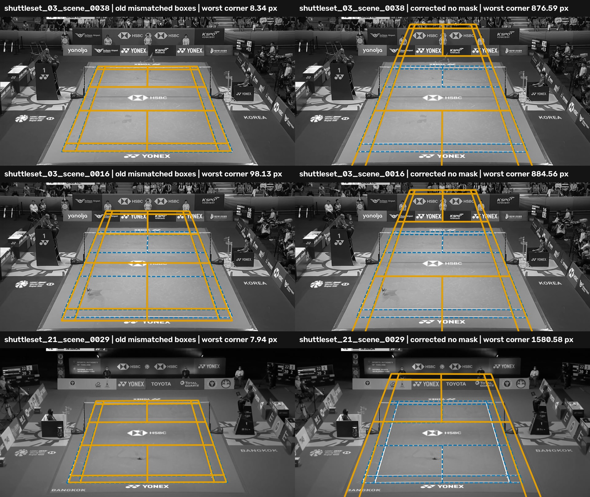

# Broadcast junction box repair

The corrected replay confirms the original practical conclusion at a lower
figure: junction-first ranking is poor on these broadcast views. Both valid
person-mask policies select a court within 15 pixels on only 1 of the 18
referenced views. The old mismatched boxes made the result look better at 3/18.

This is a development result on saved candidates. It repairs the affected
junction measurements and rankings without regenerating court candidates.

## Result

| person-mask policy | original junction ranking | paint-qualified junction ranking | same winner between rankings |
| --- | ---: | ---: | ---: |
| no spatial mask | 1/18 | 1/18 | 19/19 comparable cases |
| covered in at least two of the three median frames | 1/18 | 1/18 | 19/19 comparable cases |

The replay contains 20 cases. Nineteen have an eligible candidate, so they can
be compared across ranking policies. Accuracy uses 18 referenced views because
SS21-10 and SS21-39 both lack verified references. SS21-10 also has no eligible
candidate.

The two corrected mask policies choose the same winner in every non-empty case.
Their full rankings differ in SS03-17 and SS21-20, but only below the winner.
Paint qualification does not change any full ranking under either mask policy.

## What changed from the historical run

The replay first reproduced every saved historical ranking with its original
box input. This gate passed on all 20 cases. It then changed only the boxes used
to measure junction evidence. Candidate geometry, stripe scores, eligibility
and saved reference errors stayed fixed.

Three winners change when the mismatched boxes are removed:

| view | old error | corrected error | effect on the 15 px count |
| --- | ---: | ---: | --- |
| SS03-38 | 8.34 px | 876.59 px | accurate to wrong |
| SS03-16 | 98.13 px | 884.56 px | remains wrong |
| SS21-29 | 7.94 px | 1580.58 px | accurate to wrong |

The mismatched box inputs therefore preserved two lucky accurate winners. They
did not unfairly depress the reported performance. The historical 3/18 figure
is invalid, but the corrected 1/18 result confirms the conclusion that this
junction-first ranking is a poor broadcast solution.

SS03-17 keeps the same junction winner and 194.27 px error. That individual
observation now has valid support, although the old population summary around
it did not.

The dashed blue court is the fixed-camera reference and the solid orange court
is the selected fit. The three corrected winners are visibly misplaced, which
confirms that their large errors are real selection failures rather than a
reporting artefact.

## Mask meaning

The broadcast image is the median of three video frames. A single frame's
player boxes do not describe that composite image. The corrected composite mask
excludes a point only when player boxes cover it in at least two of the three
source frames. The no-mask arm checks whether spatial player masking helps this
decision at all.

The agreement between the two arms is useful. Occlusion handling changes some
lower-ranked candidates, but it does not explain the failed winners.

## Deployment meaning

Deployability requires both good court accuracy and practical compute time.
This junction-first branch fails the accuracy gate on this sample, so it is not
a deployment candidate.

This replay says nothing useful about production runtime. It deliberately
reuses saved candidate pools and measures only junction evidence and ranking.
Production timing must instead start after player detections are supplied,
since the wider annotator already needs those detections. It must include every
remaining step needed to locate the court from a few frames. A deployable path
must run in a sensible time on ordinary hardware. Hours of HPC work are
acceptable for parameter search, not for situating one court.

## Evidence limits

- This is a repair of the cached-candidate comparison, not a fresh end-to-end
  detector run.
- The 18 referenced views come from two broadcast videos and remain development
  data.
- Each video uses one fixed-camera reference across its scenes. The old and
  corrected arms share that assumption.
- The result closes the narrow broadcast junction-first question. It does not
  repair the separate marking-population junction records or the line-identity
  `person_observations` records.
- The machine-readable packet is in `result.json.gz`. It stores the saved
  ranking inputs and winners for each policy, plus one archive digest.
