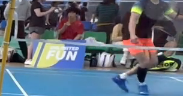
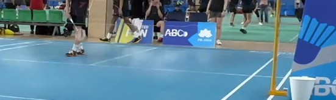

# W2 returned pixels: shared net support, and a contaminated approved control

## Decision

**The output directory being inside the repository is not a scientific problem.** The returned manifest records pinned `git show` inputs and matching worktree copies. There is no reason to rerun this job because of its output location. The executed helper has a new recorded hash; preserve that actual modified helper when tidying the result.

**The returned images resolve the main false-support question.** The long runs of false Am2-28019 `184:4123` largely follow one raised pale net band, not two court markings. But the approved Am2-150 `30:33` pair also contains borrowed support: some passing samples land on a player's white sock and on a crossing sideline. Its two nominal markings can even use the same centre-and-flank source pixels.

I would close this paired-pixel diagnostic now. It explains a real false match and tests the approved contrary example. It does **not** justify deploying either the connected-run feature or a “separate ridge for every marking” veto. No further remote run on these four intervals is recommended.

## 1. What I actually accessed and checked

I opened both full working views, both native raw crops and overlays, and both shared-coordinate strips. I read `manifest.json`, both `pair_trace.json` files, `pair_summary.json`, and the supplied atlas-producing source from the preceding handover. Unlike the earlier reviews, the physical interpretations below come from inspected pixels.

The returned run records:

| Item | Recorded identity |
| --- | --- |
| Run time | `2026-09-17T04:41:44.009485+00:00` |
| Source revision and producing HEAD | `bb6787adeca9a19b5f1d3c3324d54cfcb2ea6e68` |
| L2 witness blob | `739af3d1dacc7f3fedb551eab01a2b4bad94fd06` |
| Am2 frame28019 native-frame blob | `a6c1ace2fad3a6f350b7b91fad991840955fd866` |
| Am2 frame150 native-frame blob | `08ab1d43d219320bc18d2bfb25fbde5f5f3cf456` |
| Executed atlas script SHA-256 | `80c0e9c0b97135e08bef4d9f03da2b38b73ddc5b59526d3e2e44800e1a091252` |

Paths are under `scratch/court_det_fix/next_steps_20260916/webui_seed/`: the witness is `L2_scoring/witnesses.json`; the frames are `frames/amateur/am2/frame_00028019.png` and `frame_00000150.png`. These are the source identities reported by the producer, not a newly asserted current branch head. The full original files are not in this return; their original-file hashes were not independently recomputed here. [Manifest](evidence/manifest.json)

The recorded tracked status is empty and the tracked patch hash is the empty-string hash. That says nothing about untracked output or helper files. The executed script differs from the previous supplied script's SHA-256 (`28ee44916b1884561355ecba4a6d1a291306b1192c95fc43c09f60fd65c6fa8f`). Its exact modified source is not in the return. Both recorded helper hashes match the preceding handover. This is a provenance detail to preserve, not a reason to discard the pixel result.

I independently checked the evidence that *is* present:

* The native crops reproduce the corresponding working-image pixels exactly when their 2× downsampling is aligned to global image coordinates. This compares 12,008 working pixels in the false crop and 22,275 in the approved crop, with zero channel difference.
* A direct bilinear calculation at the saved float32 coordinates reproduces all **480 target offset pass flags**, all availability flags, and all **960 centre-versus-side contrasts** within `1.421e-5` intensity units. This is a numerical replay check, not a court-acceptance tolerance.
* The four detailed intervals reproduce their uploaded CSV counts and connected runs. The producer reports that all 48 CSV rows match the full L2 witness. Only four detailed intervals are in this return, so only those four were independently replayed here.
* The returned shared-strip intensity arrays also match direct interpolation of their working images, within `7.630e-6` intensity units. Interpolation does not add image resolution.

Executable calculations and all numerical details are in [verify_return.py](verify_return.py), [verification.json](results/verification.json), and [all_offset_checks.csv](results/all_offset_checks.csv). No detector, matcher, candidate generation or full-pool ranking was run.

## 2. False `184:4123`: the coherent support is a net band



The dominant passing run follows the raised pale band crossing in front of seats, bags/signage and the adjacent-court player's orange shorts. In the full view it is consistent with the **lower binding of the neighbouring net**, not paint on the blue floor. The important distinction is secure even without relying on the exact binding name: this is an elevated foreground structure, not two floor markings.

Both nominal markings search into that same visible band. The shared strip shows one band supplying the dense overlapping support, not separately attributable near-baseline and near-long-service paint. The isolated early passes are not all assigned a physical owner here; this conclusion concerns the conspicuous shared run, not every positive in the candidate's twelve intervals. [Raw context](evidence/184_4123/context_raw.png), [native overlay](evidence/184_4123/native_pair_overlay.png), [shared raw strip](evidence/184_4123/shared_strip_raw.png), [shared overlay](evidence/184_4123/shared_strip_overlay.png)

The coordinates make the attribution testable. Indices below are zero-based; contrasts are the saved minimum of the two centre-minus-side differences, not probabilities.

| Named interval | Station / offset | Passing centre at 960×540 | Minimum contrast |
| --- | --- | --- | ---: |
| 10: near long service | 14 / −4 px | `(909.793, 205.129)` | 117.27745 |
| 11: near baseline | 13 / −4 px | `(910.227, 205.587)` | 86.28229 |

Both samples lie in the same raised-band neighbourhood. Across the pair's **113.3064 px common longitudinal span**, the two nominal tracks are only **0.3784–0.4522 px apart**, measured along the first interval's normal. The existing offset search can therefore move both tracks onto that band. This is a fresh calculation from the returned coordinates, not an assumption that every near-coincident pair shares a physical object. [Trace](evidence/184_4123/pair_trace.json), [calculation](results/verification.json)

This narrows the earlier mechanism. It is not necessary to invoke disconnected bright fragments to explain this pair: a real, coherent, high-contrast but **wrong physical structure** supplies the positive evidence. The old description “court near the net top” was a candidate-level visual ruling; it was not a verified attribution for these particular intervals.

## 3. Approved `30:33`: approval does not certify each correspondence



This pair lies in the crowded far-court region. The image contains weak floor markings, a player crossing the tested region, the far mat/floor boundary, and a bright sideline meeting the region near the net post. I do **not** see a clean, separately attributable baseline/long-service pair throughout the sampled span.

There are specific borrowed positives, not merely an absence of clear paint:

| Nominal interval | Station / offset | Passing centre | Minimum contrast | Visible neighbourhood |
| --- | --- | --- | ---: | --- |
| 6: far baseline | 3 / +4 px | `(557.500, 217.319)` | 28.72421 | White sock / ankle |
| 7: far long service | 4 / +2 px | `(558.218, 217.282)` | 28.96789 | Same white sock / ankle |
| 6: far baseline | 20 / +4 px | `(716.627, 225.161)` | 24.86734 | Bright slanted sideline near the post |
| 7: far long service | 20 / +4 px | `(713.889, 227.223)` | 14.93887 | Same sideline neighbourhood |

The sock centres map to approximately `(126.00, 79.64)` and `(127.44, 79.56)` in the native raw crop. They are visibly on the white ankle/sock region, not the court floor. The sideline examples can be genuine court paint while still failing to corroborate the *named transverse markings*. Crossing paint is not automatically independent evidence for each line meeting the search neighbourhood. [Native overlay](evidence/30_33/native_pair_overlay.png), [raw context](evidence/30_33/context_raw.png), [trace](evidence/30_33/pair_trace.json), [selected numerical witnesses](results/verification.json)

The far-baseline run at stations 16–19 uses offset −4 and lies in the pale far-boundary neighbourhood. These pixels do not establish a clean second parallel paint stripe either. I leave the precise paint-versus-edge attribution of that boundary strip unresolved. No claim is made that every approved-pair pass is nonpaint.

**The candidate's existing approval is unchanged.** A usable court may have weak, occluded or incorrectly corroborated individual markings. The lesson is that an approved court is a contrary example for a candidate-level veto, but not a guarantee that every positive feature on that court has the intended physical owner.

### An exact shared-pixel witness in the approved pair

There is a stronger numerical counterexample to a simple sharing veto. These two passing tests use the **same twelve working grayscale source pixels**, with different bilinear weights:

| Test | Centre at working coordinates | Minimum contrast |
| --- | --- | ---: |
| Interval 6, station 1, offset 0 | `(538.975669, 212.400841)` | 10.976318 |
| Interval 7, station 2, offset −2 | `(538.949963, 212.294247)` | 11.499298 |

Their centre footprints are `{538,539} × {212,213}`; their minus-side footprints are `{539,540} × {206,207}`; their plus-side footprints are `{538,539} × {218,219}`. Coordinates in this table precede the producer's float32 map conversion; the source-pixel sets use that conversion. The interpolation weights are retained in the calculation output.

Thus these are not twelve new pixels independently corroborating each of two expected markings. Conversely, **sharing some source pixels cannot itself justify rejecting a court**: this is the approved contrary example. This does not prove that the whole pair must share all its support, or that no better assignment exists. [Exact footprints and weights](results/verification.json)

## 4. The connected-run conclusion survives the pixel inspection

All five offset tests at every station are measured in these four intervals: **zero unavailable offset tests**. Their recorded results are:

| Candidate / interval | Passing offset tests | Passing stations | Longest connected run |
| --- | ---: | ---: | ---: |
| False `184:4123` / 10 | 36/120 | 18/24 | 16 |
| False `184:4123` / 11 | 35/120 | 18/24 | 12 |
| Approved `30:33` / 6 | 15/120 | 13/24 | 4 |
| Approved `30:33` / 7 | 14/120 | 10/24 | 3 |

The false pair's stronger connectivity now has a physical explanation: it follows a coherent net band. The approved pair's weak connectivity is compatible with the mixture of weak/crowded floor evidence, a crossing player and borrowed features we can actually see. It is not a demonstrated absence of the correct court. [Independent replay](results/verification.json)

This leaves the preceding fresh-data result intact: applying the old 40% requirement to connected-run length gave a counterfactual marking score of 0.500000 for false Am2 and 0.454545 for approved Am2. Those are earlier calculations on all twelve intervals per candidate, not a new full-profile recomputation from these four returned traces. The strong scene19 separation also remains a separate result; no scene19 pixels were supplied in this return. [Prior calculations, retained unchanged](inputs/prior_fresh_analysis.json)

## 5. One reproducibility caution, resolved without a remote rerun

The producer reports OpenCV **5.0.0**; this container has **4.13.0**. Calling the installed `cv2.remap(..., INTER_LINEAR)` does not exactly reproduce the saved contrasts. Its maximum difference among these four intervals is **2.79015** intensity units. One of 480 offset pass bits changes:

* Approved interval 6, station 9, offset +2: saved minimum contrast **10.018753**, local `cv2.remap` **9.898438**.

That station falls from passing to failing under the local call, but the interval still passes and its longest run remains four. I did not silently replace the recorded result with that local result.

A direct bilinear calculation at the saved float32 coordinates reproduces **all** recorded target pass bits and the contrasts within `1.421e-5`. This connects the trace to the returned actual pixels without depending on the local remap behaviour. It is consistent with a sampling-implementation difference; this review does not claim to establish a library-wide change or its exact source commit. The recorded-runtime evidence remains the basis of the interpretation. [Runtime comparison and direct calculation](results/verification.json), [implementation](verify_return.py)

## 6. My assessment and handover decision

**This was a worthwhile experiment, and it is now complete.** It moved the explanation from “nearly coincident markings might borrow evidence” to inspected examples of that happening on a net band, while also showing why the approved control defeats a simple fix.

The approaches so far have been useful for proposing courts and exposing mechanisms. The remaining obstacle is not a lack of candidate arithmetic or compute. It is that an appearance match can have the wrong physical owner or the wrong marking identity. The approved example also shows why the solution cannot demand that every visible marking has pristine evidence.

I would not fit another combination of connectivity, contrast, marking separation and exclusivity on this small panel. Nor would I reinstate the old floor gate, which has the already documented approved-control failures. The present proposal machinery can remain useful with manual approval; these results do not establish automatic acceptance.

**No further remote experiment is recommended as part of this return.** In particular, do not expand the connected-run probe to the full pools merely because this job ran successfully. It failed the specified contrary-example test. A future detector change must add a defensible observation about physical surface or marking correspondence, rather than recounting the same bright structure. That is a requirement for future design, not an extra task hidden in this handover.

For the immediate tidy-up, retain the actual modified `build_pair_atlas.py` matching the executed hash, its manifest, these four interval traces, the raw/overlay evidence and this readout. Outputs inside the repository are fine. The new pack also contains a standalone verification script and six passing tests; they reproduce the calculations without repository imports or new model execution.

Suggested status: **W2 paired-pixel diagnostic complete; false-pair shared net support established; approved-pair feature contamination established; standalone coherence/sharing veto not adopted.**

## Reproduction and boundaries

```bash
python verify_return.py --evidence evidence \
  --csv inputs/real_interval_probe.csv --out results
python -m unittest -v test_verify_return
```

The evidence folder is an unmodified extraction of the returned archive. The reviewed input archive SHA-256 is `e51d9c6bc56e63d81560d665525016362f165e737c8378dd9bfe3097bdaff1ec`. Per-file hashes are in `results/evidence_sha256.json`.

Visual interpretations are recorded separately from calculations in `results/visual_readout.json`. They do not relabel the candidates, turn isolated sample locations into a training set, or assert an acceptance/false-positive rate. No repository file was changed in this review.
