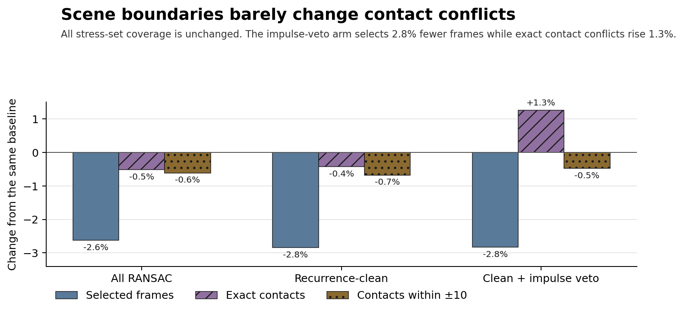

# Scene-aware RANSAC result

## Bottom line

Scene-aware fitting is sensible estimator hygiene. It does not make the proposed RANSAC guard meaningfully safer on these fixtures.

The scene rule reduces the policy-relevant mask by 330 frames, from 11,660 to 11,330. It keeps the same 7 of 18 difficult hallucination spans. At the practical ±10 base-30 contact margin, labelled contacts at risk fall by only 6, from 1,249 to 1,243.

The tighter checks get slightly worse. Exact contact conflicts rise from 239 to 242. Exact final-contact conflicts rise from 22 to 23. Contacts at the ideal ±5 margin rise from 937 to 940.

That fails the predeclared follow-up rule. A remote E2E replay for scene awareness alone is not worth the cost. The next useful test is narrow protection around serve-setup-qualified fast bursts.



## What changed

The experiment kept the original 16-frame quadratic model, four-frame step, 32 deterministic trials, eight-inlier floor, three-pixel residual, and majority vote.

It changed one rule:

```text
Do not fit a model window when start < scene cut < stop.
```

Across the three fixtures, 6,059 of 101,047 scheduled windows cross a cut. Of those crossing windows:

- 1,850 already contain `(0, 0)` and cannot be fitted;
- 1,157 fail to produce an eligible RANSAC model; and
- 3,052 previously contributed votes.

The script proved its unchanged arm field-for-field against the original fitter. It also matched all three stored candidate masks and vote audits before applying the scene rule.

## Main comparison

| Mask | Frames before | Frames after | Exact contacts before → after | Contacts within ±10 before → after | Positive spans before → after |
| --- | ---: | ---: | ---: | ---: | ---: |
| All RANSAC | 107,251 | 104,437 | 1,742 → 1,733 | 2,938 → 2,920 | 18/18 → 18/18 |
| Recurrence-v4 clean | 39,480 | 38,357 | 1,656 → 1,649 | 2,818 → 2,799 | 18/18 → 18/18 |
| Clean and outside the three-frame impulse veto | 11,660 | 11,330 | 239 → 242 | 1,249 → 1,243 | 7/18 → 7/18 |

Removing crossing windows changes both vote counts and the eligible-window denominator. The scene-aware arms therefore add some candidates while removing others:

- all RANSAC: 4,151 removed and 1,337 added;
- recurrence-clean: 1,398 removed and 275 added; and
- recurrence-clean with impulse veto: 452 removed and 122 added.

The `sset_15` span at `[74255, 74257)` survives unchanged in the raw and recurrence-clean masks. The impulse veto already excludes it in both arms.

## What this means

The quadratic model should not assume pixel continuity across camera cuts. If RANSAC is revisited later, the scene gate is a reasonable part of the estimator.

It does not solve the safety problem. In the policy-relevant arm, selected frames fall by 2.8%. Contact risk at ±10 falls by 0.5%. Exact and ideal-margin conflicts rise slightly.

The result does not estimate precision. The 18 reviewed spans contain only known hallucinations. Label proximity is a warning about contact safety, not proof that every selected coordinate is real or false.

## Reproduce it

From the repository root:

```bash
~/.venvs/badminton-cicd/bin/python \
  scratch/ransac_scene_guard/scene_aware_ransac.py

~/.venvs/badminton-cicd/bin/python \
  scratch/ransac_scene_guard/plot_scene_result.py
```

The compact result is `results/scene_aware_ransac.json.gz`. It records input digests, full per-fixture measures, all 18 span outcomes, base-30 contact tolerances, and added/removed counts.
