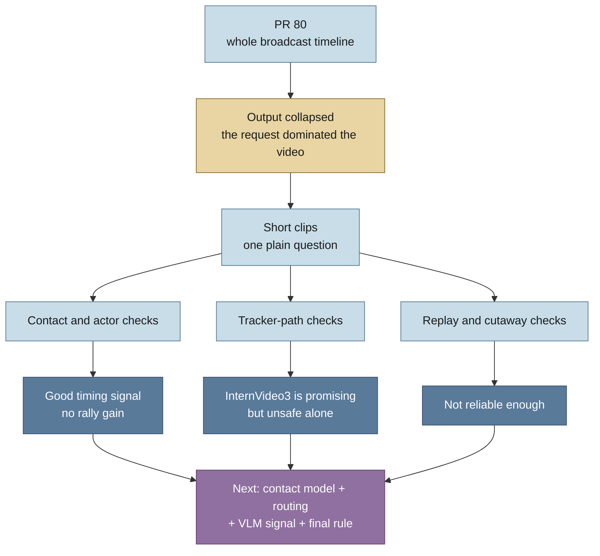

# VLM cleanup investigation

## Bottom line

The VLM idea is still useful, but its role is now much narrower. Neither
Qwen3-VL nor InternVideo3 should decide by itself whether an annotation stays.
InternVideo3 may be useful for one specific check: whether a marked tracker path
really follows the shuttle.

PR 80 failed because it tested the wrong job. It asked each model to label a
whole broadcast timeline and return an eight-character code for every sampled
frame. The only worked example became the repeated answer. InternVideo3
repeated one code until it hit the output limit. Qwen3-VL repeated a slightly
changed version of the same code. This tells us little about either model's
ability to check one proposed annotation.

## Clip lengths at a glance

The later trials used several time scales because each check needs different
context:

- **Two seconds:** contact and tracker-path checks, usually presented as 50
  frames. Slow tracker clips repeated or enlarged part of the same source span.
- **Ten seconds:** the short scene checks and Qwen's PR 80 boundary test, each
  sampled into 50 frames.
- **Twenty seconds:** broadcast cleanup, sampled into 50 frames with the
  four-second target shown most densely.
- **Twenty minutes:** InternVideo3's exceptional PR 80 whole-timeline run,
  sampled at 1 FPS into 1,200 frames.

## What we tried after PR 80

Short, plain questions stopped the repeated-output failure. The later trials
then tested the useful parts of the cleanup job:

- **Contact timing:** on 60 balanced cases, Qwen3-VL reached 88.6% precision
  and 97.5% recall at ±15 base-30 frames. InternVideo3 reached 83.3% precision
  and 50.0% recall. This was structural timing truth, not proof that contact was
  visible.
- **Complete rallies:** Qwen3-VL removed 14 of 84 proposed contacts across 12
  rallies. The number with the exact contact count stayed at 4. Only 1 rally
  was structurally usable at ±10 frames before and after cleanup.
- **Player attribution:** both models were poor at the actor answer, so retain
  the existing alternating-player logic.
- **Tracker validity:** InternVideo3 rejected 16 of 18 known hallucinations
  when shown a slow, enlarged view with the claimed path marked. It accepted
  all 18 comparison clips near ShuttleSet contacts. Those comparisons are not
  human-labelled real tracks, and two known hallucinations still passed.
- **Replay and cutaway removal:** neither model was reliable. A stronger
  sequence prompt helped InternVideo3 notice replay, but it also rejected four
  of six live controls.

The path through the investigation is:

## What we learned

The models can follow short output formats and discuss visible content. The
catastrophic PR 80 result was therefore mainly a request-design failure.

Better wording is not enough. The VLM needs the right pixels, one narrow
question, and a proposed event to inspect. Existing pipeline signals are more
useful for deciding which cases need a VLM call than as a block of facts pasted
into every prompt. Final scoring must use complete rallies. Candidate-level
precision can hide wrong contact counts and broken attribution.

The current raw candidate pool also limits the result. Even an oracle can make
only 56 rallies complete at ±10 frames. A cleanup stage cannot recover contacts
that were never proposed.

## What happens next

Wait for the planned binary contact detector. Freeze its scores on `sset_01`
and `sset_15`, then compare it with one combined automatic rule:

1. keep clear, high-score contacts without a VLM call;
2. send tracker-risk cases to InternVideo3's marked, enlarged check;
3. combine the contact score, existing evidence, and VLM answer;
4. score exact contact count, alternating attribution, point outcome, and
   timing on complete rallies;
5. freeze the rule before one check on `sset_21`.

If the combined rule beats the contact-only baseline, run the full fixtures.
If it does not, leave the VLM out. No new human labelling is needed.

## Where the detail lives

- **Understand what was tried:** [`experiments.md`](experiments.md) maps every
  trial; [`prompts.md`](prompts.md) gives the prompt variants.
- **Inspect the evidence:** [`evaluation.md`](evaluation.md) explains PR 80;
  [`results.md`](results.md) gives the main numbers;
  [`sources.md`](sources.md) points to the source record.
- **Run the next work:**
  [`experiments/next_experiment.md`](experiments/next_experiment.md) gives the
  exact test and stop rules; [`experiments/README.md`](experiments/README.md)
  explains the reusable scripts and GPU launchers.
